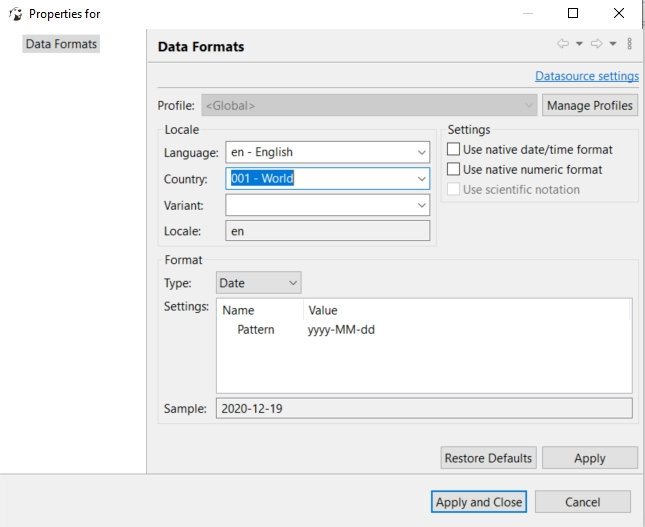
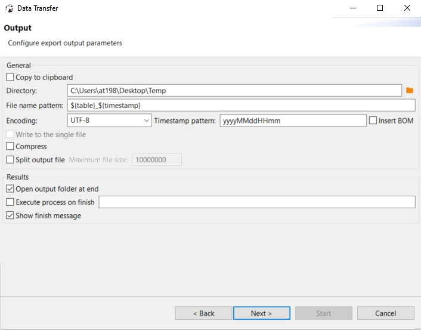

# Import și export

## Import

Pasul 1: Se selectează o bază de date și o tabelă, se da click-dreapta urmat de click pe Import

Pasul 2: Se alege formatul de date de import 

Pasul 3: Se alege un fișier local

Pasul 4: Setare informații despre input file

Pasul 5: Maparea la tabele din baza de date

Pasul 6: Setare import

Pasul 7: Confirmare

---

## Rezultat după import

---

## Export

Pasul 1: Alegerea formatului în care se doresc exportate datele

Pasul 2: Setări CSV

Pasul 3: Setări format date

Pasul 4: Setare fișier (cale, denumire, encodare)

Pasul 5: Confirmarea exportului

