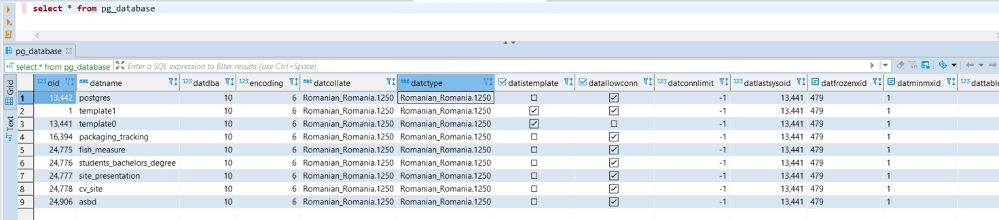
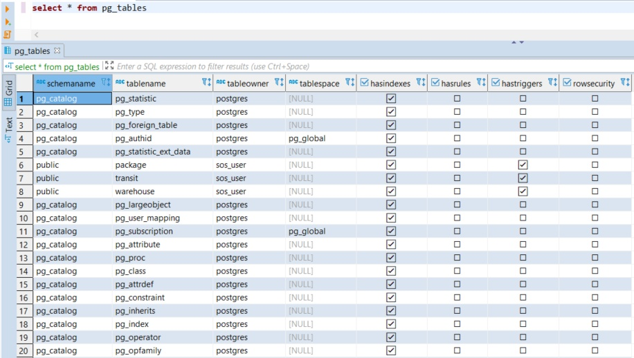
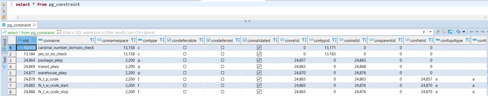
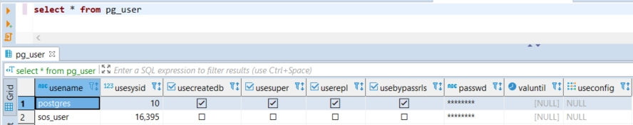
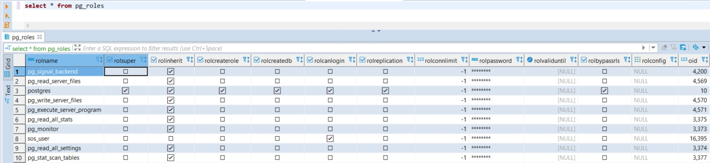

# Monitorizarea bazei de date

## Catalogul de sistem

PostgreSQL, ca alte sisteme de gestiune a bazelor de date, oferă o colecție de tabele în care sunt înregistrate informații despre obiectele baza de date si utilizatori.

 

Mai multe informații despre catalog pot fi consultate pe pagina [Documentație PostgreSQL](https://www.postgresql.org/docs/13/catalogs-overview.html)

---

### pg_database

Catalogul **pg_database** stochează informații despre bazele de date disponibile. Bazele de date sunt create cu comanda `CREATE DATABASE`.

Spre deosebire de majoritatea cataloagelor de sistem, pg_database este partajat în toate bazele de date ale unui cluster: există o singură copie a pg_database pe cluster, nu una pe bază de date.

---

### pg_tables

Vizualizarea **pg_tables** oferă acces la informații utile despre fiecare tabel din baza de date.

---

### pg_constraint

Catalogul **pg_constraint** stochează, cheia primară, cheia unică, străină și constrângerile de excludere pe tabele (Constrângerile coloanei nu sunt tratate special. Fiecare constrângere de coloană este echivalentă cu o constrângere de tabel.). Constrângerile care nu sunt nule sunt reprezentate în catalogul **pg_attribute**, nu in acest dicționar.

Declanșatoarele de constrângeri definite de utilizator (create cu CREATE CONSTRAINT TRIGGER) generează, de asemenea, o intrare în acest tabel. Verificarea constrângerilor de pe domenii este stocată și aici.

---

### pg_user

Vizualizarea **pg_user** oferă acces la informații despre utilizatorii bazei de date. Aceasta este pur și simplu o vizualizare publică a **pg_shadow**, care elimină câmpul parolei.

---

### pg_roles

Vizualizarea **pg_roles** oferă acces la informații despre rolurile bazei de date. Aceasta este pur și simplu o vizualizare citibilă publică a **pg_authid** care elimină câmpul parolei.

Această vizualizare expune în mod explicit coloana OID a tabelului de bază, deoarece aceasta este necesară pentru a face îmbinări la alte cataloage.

