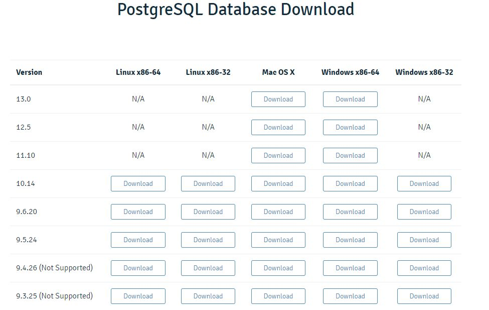
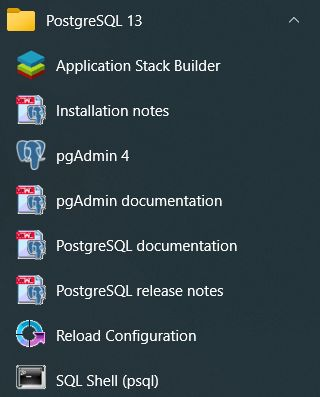
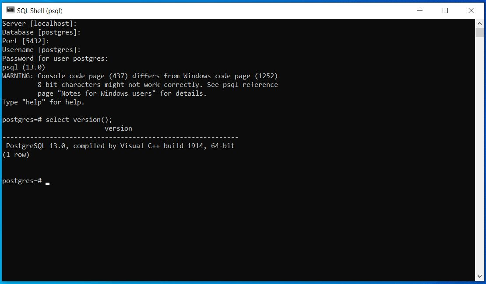
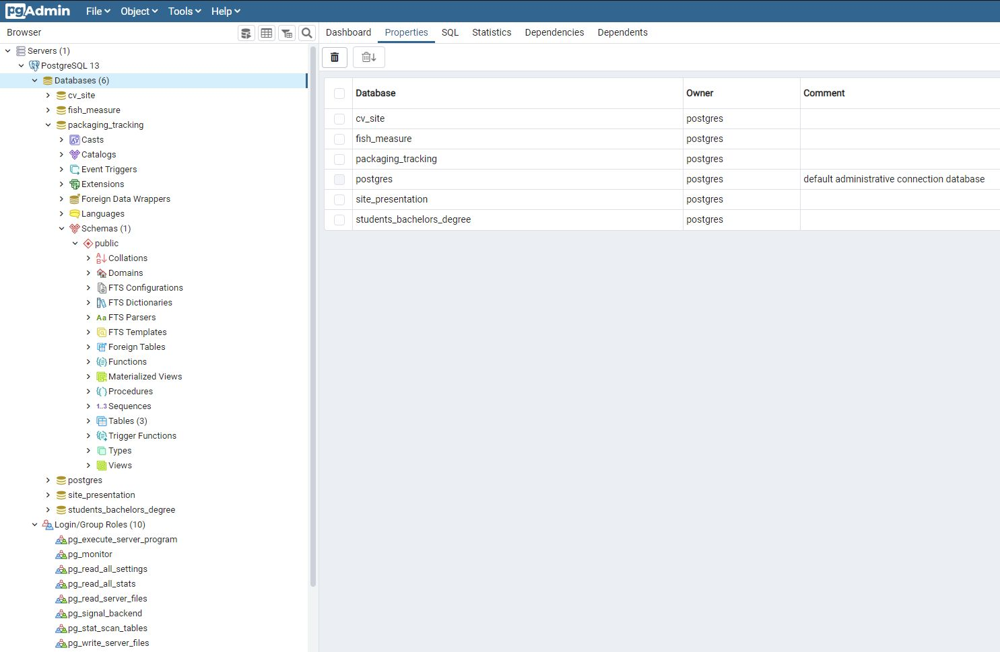
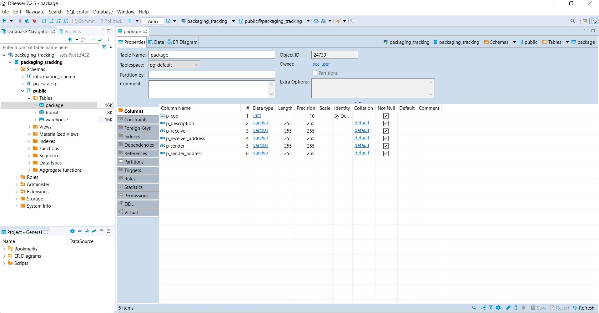

# Instalare Server PostgreSQL

## Selectarea versiunii

Pentru download vizitati [site-ul oficial](https://www.enterprisedb.com/downloads/postgres-postgresql-downloads)

## Pasi instalare

Instalarea este in principal foarte simpla, sunt necesare urmatoarele configurari: 
* selectarea componentelor
    - **server PostgreSql**
    - **pgAdmin 4** care este o interfata web pentru managementul bazelor de date
    - **Command line** pentru interactiunea in linie comanda cu baza de date
    - **Stack Builder** GUI pentru instalarea de drivere(optional)
* cale de instalare
* parola pentru superuser (postgres)
* port-ul (care este recomandat sa ramana cel default)
* locatie (care ramane cea default)

Dupa instalare, va apare in meniul de la start urmatoarele:

Pentru un tutorial mai explicit al instalarii vizitati site-ul: [Postgres Tutorial](https://www.postgresqltutorial.com/install-postgresql/)

## Test PostgreSQL

Dupa instare se porneste commandline-ul, se introduc datele necesare (parola, la restul este suficient sa se dea enter la valorile default) si se tasteaza `select version();`.

Sau se poate deschide pgAdmin care este o interfata web de administrare.

## Alternativa pentru tool de administrare

[DBeaver Community](https://dbeaver.io) este un tool universal de administrare al bazelor de date.

Se creeaza cate o conexiune pentru fiecare baza de date pe care dorim sa o utilizam/administram.

