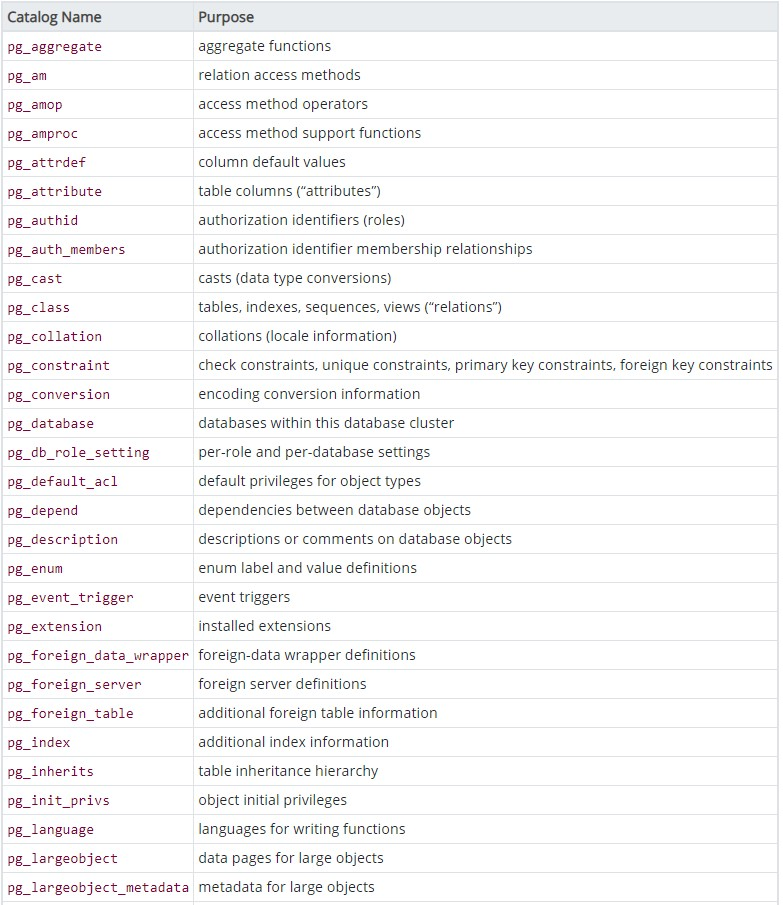
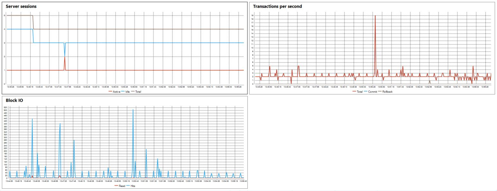
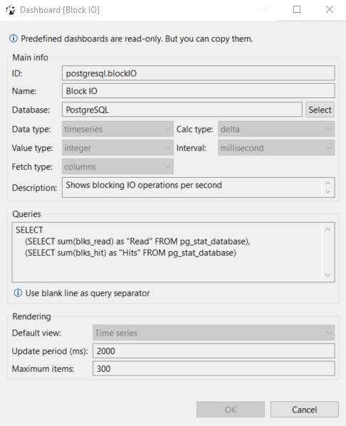
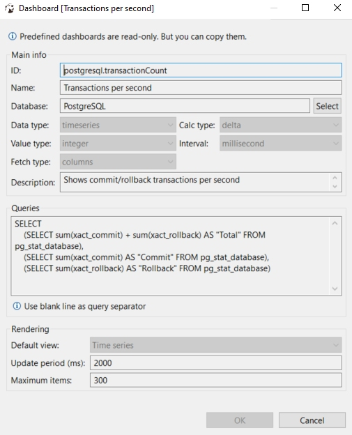

# Monitorizarea bazei de date

## Catalogul de sistem

PostgreSQL, ca alte sisteme de gestiune a bazelor de date, oferă un colecție de tabele ion care sunt înregistrate informații despre obiectele baza de date si utilizatori.

 

Mai multe informații despre catalog pot fi consultate pe pagina [Documentație PostgreSQL](https://www.postgresql.org/docs/13/catalogs-overview.html)

---

## Activitate baza de date

```sql 
select * from pg_catalog.pg_stat_activity;
```

|datid|datname|pid|leader_pid|usesysid|usename|application_name|client_addr|client_hostname|client_port|backend_start|xact_start|query_start|state_change|wait_event_type|wait_event|state|backend_xid|backend_xmin|query|backend_type|
|-----|-------|---|----------|--------|-------|----------------|-----------|---------------|-----------|-------------|----------|-----------|------------|---------------|----------|-----|-----------|------------|-----|------------|
|||5772||10|postgres|||||2020-12-12 14:11:30||||Activity|LogicalLauncherMain|||||logical replication launcher|
|||5740||||||||2020-12-12 14:11:30||||Activity|AutoVacuumMain|||||autovacuum launcher|
|24906|asbd|7648||10|postgres|DBeaver 7.2.5 - Main <asbd>|127.0.0.1||58737|2020-12-13 13:39:49||2020-12-13 13:51:39|2020-12-13 13:51:39|Client|ClientRead|idle|||COMMIT|client backend|
|16394|packaging_tracking|10660||16395|sos_user|DBeaver 7.2.5 - Main <packaging_tracking>|127.0.0.1||58730|2020-12-13 13:39:31||2020-12-13 13:47:46|2020-12-13 13:47:46|Client|ClientRead|idle|||COMMIT|client backend|
|16394|packaging_tracking|13540||16395|sos_user|DBeaver 7.2.5 - Metadata <packaging_tracking>|127.0.0.1||58733|2020-12-13 13:39:31|2020-12-13 14:03:22|2020-12-13 14:03:22|2020-12-13 14:03:22|||active||820|SELECT
    (SELECT sum(xact_commit) + sum(xact_rollback) AS "Total" FROM pg_stat_database),
    (SELECT sum(xact_commit) AS "Commit" FROM pg_stat_database),
    (SELECT sum(xact_rollback) AS "Rollback" FROM pg_stat_database)|client backend|
|13442|postgres|4520||10|postgres|psql|::1||58725|2020-12-13 13:38:16||2020-12-13 13:38:29|2020-12-13 13:38:30|Client|ClientRead|idle|||create database ASBD;|client backend|
|24906|asbd|7212||10|postgres|DBeaver 7.2.5 - Metadata <asbd>|127.0.0.1||58738|2020-12-13 13:39:49||2020-12-13 14:01:40|2020-12-13 14:01:40|Client|ClientRead|idle|||SELECT c.relname,a.*,pg_catalog.pg_get_expr(ad.adbin, ad.adrelid, true) as def_value,dsc.description
FROM pg_catalog.pg_attribute a
INNER JOIN pg_catalog.pg_class c ON (a.attrelid=c.oid)
LEFT OUTER JOIN pg_catalog.pg_attrdef ad ON (a.attrelid=ad.adrelid AND a.attnum = ad.adnum)
LEFT OUTER JOIN pg_catalog.pg_description dsc ON (c.oid=dsc.objoid AND a.attnum = dsc.objsubid)
WHERE NOT a.attisdropped AND c.oid=$1 ORDER BY a.attnum|client backend|
|16394|packaging_tracking|1256||16395|sos_user|DBeaver 7.2.5 - Main <packaging_tracking>|127.0.0.1||58754|2020-12-13 13:40:51||2020-12-13 13:40:51|2020-12-13 13:40:51|Client|ClientRead|idle|||SHOW search_path|client backend|
|16394|packaging_tracking|11808||16395|sos_user|DBeaver 7.2.5 - Metadata <packaging_tracking>|127.0.0.1||58755|2020-12-13 13:40:51||2020-12-13 13:40:51|2020-12-13 13:40:51|Client|ClientRead|idle|||SHOW search_path|client backend|
|24906|asbd|4392||10|postgres|DBeaver 7.2.5 - SQLEditor <Script-1.sql>|127.0.0.1||58767|2020-12-13 13:45:42|2020-12-13 14:03:22|2020-12-13 14:03:22|2020-12-13 14:03:22|||active||820|SELECT * FROM pg_stat_activity|client backend|
|||5724||||||||2020-12-12 14:11:30||||Activity|BgWriterHibernate|||||background writer|
|||5712||||||||2020-12-12 14:11:30||||Activity|CheckpointerMain|||||checkpointer|
|||5732||||||||2020-12-12 14:11:30||||Activity|WalWriterMain|||||walwriter|

---

## Dashboard-uri (utilizând DBeaver)

Cu ajutorul acestui Tool, se pot defini dashboard-uri interactive cu ajutorul cărora se poate urmări activitatea bazei de date, așa cum se poate aprecia în imaginea de mai jos.



Acestea pot fi configurate ușor, pentru a afișa informațiile de interes. Mai jos sunt 2 exemple de configurări.



