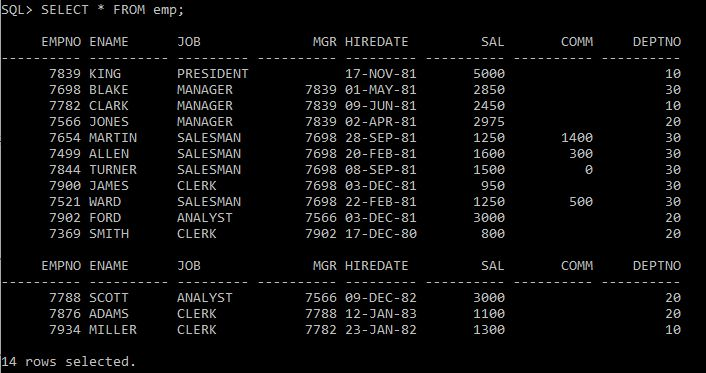
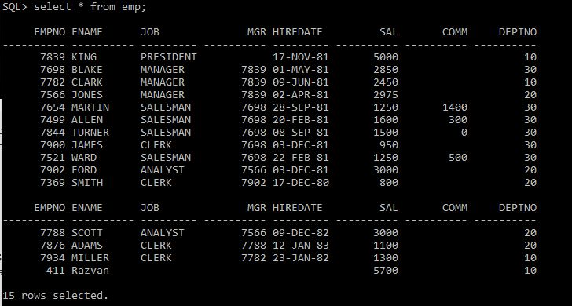

# Laborator PL/SQL 1

## Conectare
**Mod de lucru:** serverul de la facultate


## Exercitii

A. Care sunt declaratiile invalide ?

| interogare | rezultat |
|--|--|
| `nom_varA NUMBER(8) DEFAULT 10 ;` | valid |
| `nom_var VARCHAR2(20) NOT NULL ;` | invalid pt ca e declaratie e not null dar variabila nu e initializata |
| `nom_var BOOLEAN :=1 ;` | invalid pt ca booleanul are valori true sau false |
| `nom_var BINARY_INTEGER ;` | valid |
| `2nom_var BINARY_INTEGER ;` | invalid, numele de variabile nu incep cu cifre |
| `nom_varI NUMBER(3) :=123.45678 ;` | valid |
| `nom_var NUMBER(3) :=1234.5678 ;` | invalid, valoare nu poate fi memorata, number este declarat de 3 cifre |
| `nom_varK CONSTANT NUMBER(12,3) :=123.45678 ;` |  valid, numarul se rotunjeste |

---

 B. Care este rezultatul afişat de programul următor?
 


Rezultat: Numele urilizatorului curent

**ATENTIE:** trebuie executata comanda `set serveroutput on` pentru ca blocul sa poata afisa pe ecran

---
 
C. Creaţi un bloc PL/SQL în care declaraţi variabilele de la secţiunea A, punctele 1,6,8. Afişaţi informaţiile stocate în aceste variabile.

~~~sql
DECLARE
nom_varA NUMBER(8) DEFAULT 10; 
nom_varI NUMBER(3) :=123.45678; 
nom_varK CONSTANT NUMBER(12,3) :=123.45678;
BEGIN
dbms_output.put_line ('nom_varA = ' || nom_varA);
dbms_output.put_line ('nom_varI = ' || nom_varI);
dbms_output.put_line ('nom_varK = ' || nom_varK);
END;
/
~~~

**Rezultat**
```bash
nom_varA = 10
nom_varI = 123
nom_varK = 123.457
```

---

D. Care sunt expresiile valide care pot înlocui trei puncte din blocul următor?
```sql
declare
 v_1 emp%ROWTYPE ;
begin
…
end ;
/
```
| SQL | Rezultat |
|--|--|
| `SELECT * INTO v_1 FROM emp WHERE empno= 7900 ;` | valid - scoate din baza de date o inregistrare pe care o pune in v_1 |
| `UPDATE emp SET ROW=v_1 WHERE empno= 7900;` | invalid - in variabila v_1 nu exista date care sa poata fi introduce (mai ales ca empno are constrangeri de not null) |
| `SELECT COUNT(*) INTO v_1 FROM emp WHERE 1=2 ;` | invalid - v_1 este de tipul unui rand din tabela emp, nu poate stoca un numar returnat de count |
| `SELECT * INTO v_1 FROM emp WHERE 1=2 ;` | invalid - variavila v_1 trebuie sa contina o inregistrare |
| `SELECT * INTO v_1 FROM emp ;` | invalid - variabila v_1 nu poate stoca mai mult de o inregistrare, iar subinterogarea returneaza toate randurile din emp  |

---

E. Creati blocul PL/SQL care afiseaza cel mai mare salariu a departamentului SALES, utilizând o variabila de legatura.

```sql
DECLARE
sal_max emp.sal%TYPE;
BEGIN
    SELECT MAX(sal) INTO sal_max 
    FROM emp 
    WHERE deptno = (
                        SELECT deptno  
                        FROM dept
                        WHERE dname='SALES'
                    );
    dbms_output.put_line('Cel mai mare salariu este: ' || sal_max);
END;
/
```

**Rezultat:**

```sql
Cel mai mare salariu este: 2850
```

---

F. Creati blocul PL/SQL care preia de la tastatura un nume de departament si returneaza un mesaj ce indica numarul de angajati la acest departament.

```sql
ACCEPT deptname PROMPT 'Introduceti numele departamentui '
DECLARE 
nume_dept dept.dname%type;
total number(2);
BEGIN
    nume_dept :='&deptname';
    SELECT COUNT(*) INTO total 
    FROM emp 
    WHERE deptno=(
                    SELECT deptno 
                    FROM dept 
                    WHERE dname = UPPER(nume_dept)
                );
    dbms_output.put_line('Numarul total de angajati din departamentul ' || UPPER(nume_dept) || ' este ' || total || '.';
END;
/
```

Rezultatul (in cazul departamentului Sales):
```sql
Numarul total de angajati din departamentul SALES este 6.
```

---

G. Creati blocul PL/SQL care permite inserarea unui nou angajat: 
- utilizati variabile de substitutie pentru parametrizarea blocului PL/SQL, pentru numele si codul angajatului ;
- pentru salariu, utilizati rezultatul de la sectiunea E, dublat; 
- celelalte coloane ramân nule.

Confirmati (validati actualizarile).

Dupa executie, afisati tabela.

```sql
SELECT * FROM emp;
```


```sql
ACCEPT empcod PROMPT 'Introduceti codul angajatului '
ACCEPT empname PROMPT 'Introduceti numele angajatului '
DECLARE 
cod_emp emp.empno%type;
nume_emp emp.ename%type;
salariu emp.sal%type;
BEGIN
    cod_emp := &empcod;
    nume_emp := '&empname';
    SELECT MAX(sal) INTO salariu 
    FROM emp 
    WHERE deptno = (
                        SELECT deptno  
                        FROM dept
                        WHERE dname='SALES'
                    );
    INSERT INTO emp(empno, ename, sal, deptno) VALUES(cod_emp, nume_emp, salariu*2, 10);
END;
/
SELECT * FROM emp;
ROLLBACK;
```

Rezultate (pentru 411 si Razvan):


---

H. Creati blocul PL/SQL care permite modificarea locatiei unui departament :
- utilizati variabilele de substitutie pentru a parametriza blocul PL/SQL, pentru numele departamentului si noua locatie. 
Confirmati (validati) actualizarile.
Dupa executie, afisati tabela.

```sql
ACCEPT nume_departament PROMPT 'Introduceti numele departamentului '
ACCEPT loc_nou PROMPT 'Introduceti noua locatie '
DECLARE 
loc_dept dept.loc%type;
nume_dept dept.dname%type;
BEGIN
    nume_dept := '&nume_departament';
    loc_dept := '&loc_nou';
    UPDATE dept
    SET loc = loc_dept
    WHERE dname = nume_dept;
END;
/

SELECT * FROM DEPT;
ROLLBACK;
```

Rezultat (pentru SALES si Bucuresti):
```sql
    DEPTNO DNAME          LOC
---------- -------------- -------------
        10 ACCOUNTING     NEW YORK
        20 RESEARCH       DALLAS
        30 SALES          Bucuresti
        40 OPERATIONS     BOSTON
```

---

I. Creati blocul PL/SQL care permite stergerea angajatilor unui anumit departament, a carui
nume este introdus de la tastatura printr-o variabila de substitutie. Afisati numarul de linii afectate (SQL%ROWCOUNT).
Dupa executie, afisati tabela.

```sql
ACCEPT nume_departament PROMPT 'Introduceti numele departamentului '
DECLARE 
numar_delete number(3) DEFAULT 0;
nume_dept dept.dname%type;
BEGIN
    nume_dept := '&nume_departament';
    DELETE FROM emp
    WHERE deptno = (
                        SELECT deptno
                        FROM dept
                        WHERE dname=nume_dept
                    );
    numar_delete := SQL%ROWCOUNT;
    dbms_output.put_line('Numarul de angajati stersi este ' || numar_delete);
END;
/

SELECT * FROM emp;
ROLLBACK;
```

Rezultat (pentru SALES):
```sql
Numarul de angajati stersi este 6

     EMPNO ENAME      JOB              MGR HIREDATE         SAL       COMM     DEPTNO
---------- ---------- --------- ---------- --------- ---------- ---------- ----------
      7839 KING       PRESIDENT            17-NOV-81       5000                    10
      7782 CLARK      MANAGER         7839 09-JUN-81       2450                    10
      7566 JONES      MANAGER         7839 02-APR-81       2975                    20
      7902 FORD       ANALYST         7566 03-DEC-81       3000                    20
      7369 SMITH      CLERK           7902 17-DEC-80        800                    20
      7788 SCOTT      ANALYST         7566 09-DEC-82       3000                    20
      7876 ADAMS      CLERK           7788 12-JAN-83       1100                    20
      7934 MILLER     CLERK           7782 23-JAN-82       1300                    10
```

---

J. Creati un bloc PL/SQL care gaseste in doi pasi numele departamentului in care lucreaza un angajat: mai intai cauta in tabela emp un angajat dupa nume (introdus la tastatura), iar apoi cauta numele departamentului in tabela dept.

```sql
ACCEPT nume_angajat PROMPT 'Introduceti numele angajatului '
DECLARE
nume_emp emp.ename%type;
nr_dept emp.deptno%type;
nume_dept dept.dname%type;
BEGIN
    nume_emp := '&nume_angajat';
    SELECT deptno INTO nr_dept
    FROM emp
    WHERE ename = nume_emp;
    SELECT dname INTO nume_dept
    FROM dept
    WHERE deptno = nr_dept;
    dbms_output.put_line('Numele departamentului la care lucreaza ' || nume_emp || ' este ' || nume_dept);
END;
/
```

Rezultat (pentru ADAMS):
```sql
Numele departamentului la care lucreaza ADAMS este RESEARCH
```

---

K. Creati un alt bloc PL/SQL care face acelasi lucru, intr-un singur pas.
```sql
DECLARE
    nume_emp emp.ename%type;
    nume_dept dept.dname%TYPE;
BEGIN
    nume_emp := '&nume_angajat';
    SELECT dname INTO nume_dept
    FROM dept
    WHERE deptno = (
                        SELECT deptno 
                        FROM emp 
                        Where ename = nume_emp);
    dbms_output.put_line('Numele departamentului la care lucreaza ' || nume_emp || ' este ' || nume_dept);
END;
/
```

Rezultat (pentru ADAMS):
```sql
Numele departamentului la care lucreaza ADAMS este RESEARCH
```

---

L. Creati un bloc PL/SQL care cauta un angajat in tabela emp dupa numele sau (introdus la tastatura) si care ii modifica jobul in ‘EXPERT’ daca salariul este mai mare decat 2800.

```sql
ACCEPT nume_angajat PROMPT 'Introduceti numele angajatului '
DECLARE
    cod_emp emp.empno%TYPE;
    salariu emp.sal%TYPE;
    nume_emp emp.ename%type;
BEGIN
    nume_emp := '&nume_angajat';
    SELECT empno, sal INTO cod_emp, salariu
    FROM emp
    WHERE ename = nume_emp;
    IF salariu > 2800 THEN
        UPDATE emp SET job='EXPERT' WHERE empno = cod_emp;
    END IF;
END;
/
SELECT * FROM emp;
ROLLBACK;
``` 

Rezultat (pentru SCOTT):
```sql
     EMPNO ENAME      JOB              MGR HIREDATE         SAL       COMM     DEPTNO
---------- ---------- --------- ---------- --------- ---------- ---------- ----------
      7839 KING       PRESIDENT            17-NOV-81       5000                    10
      7698 BLAKE      MANAGER         7839 01-MAY-81       2850                    30
      7782 CLARK      MANAGER         7839 09-JUN-81       2450                    10
      7566 JONES      MANAGER         7839 02-APR-81       2975                    20
      7654 MARTIN     SALESMAN        7698 28-SEP-81       1250       1400         30
      7499 ALLEN      SALESMAN        7698 20-FEB-81       1600        300         30
      7844 TURNER     SALESMAN        7698 08-SEP-81       1500          0         30
      7900 JAMES      CLERK           7698 03-DEC-81        950                    30
      7521 WARD       SALESMAN        7698 22-FEB-81       1250        500         30
      7902 FORD       ANALYST         7566 03-DEC-81       3000                    20
      7369 SMITH      CLERK           7902 17-DEC-80        800                    20
      7788 SCOTT      EXPERT          7566 09-DEC-82       3000                    20
      7876 ADAMS      CLERK           7788 12-JAN-83       1100                    20
      7934 MILLER     CLERK           7782 23-JAN-82       1300                    10
```

---

M. Creati un bloc PL/SQL care cauta un angajat in tabela emp dupa numele sau (introdus la tastatura) si care afiseaza un calificativ pentru salariul sau (*foarte bun*, *bun*, *destul de bun*, *deloc bun*) in functie de salariul inregistrat in tabela. 

```sql
ACCEPT nume_angajat PROMPT 'Introduceti numele angajatului '
DECLARE
    nume_emp emp.ename%type;
    cod_emp emp.empno%TYPE;
    salariu emp.sal%TYPE;
BEGIN
    nume_emp := '&nume_angajat';
    SELECT sal INTO salariu
    FROM emp
    WHERE ename = nume_emp;
    CASE 
        WHEN salariu < 1000 THEN
            dbms_output.put_line('salariu deloc bun');
        WHEN salariu BETWEEN 1000 AND 2000 THEN
            dbms_output.put_line('salariu destul de bun');
        WHEN salariu BETWEEN 2000 AND 3000 THEN
            dbms_output.put_line('salariu bun');
        ELSE
            dbms_output.put_line('salariu foarte bun');
    END CASE;
END;
/
```

Rezultat (pentru SCOTT):
```sql
salariu bun
```

---

N. Creati un bloc PL/SQL care calculeaza suma primelor 100 numere intregi. (utilizati o bucla *cat timp*)
```sql
DECLARE
    i number(3) := 1;
    suma number(4) := 0;
BEGIN
    WHILE i <= 100 LOOP
        suma := suma + i;
        i := i + 1;
    END LOOP;
    dbms_output.put_line('Suma primelor ' || (i-1) || ' numere este ' || suma);
END;
/
```

Rezultat:
```sql
Suma primelor 100 numere este 5050
```

---

O. Creati un bloc PL/SQL care calculeaza suma primelor 100 numere intregi. (utilizati o bucla *pana cand*)
```sql
DECLARE
    i number(3) := 1;
    suma number(4) := 0;
BEGIN
    LOOP
        suma := suma + i;
        i := i + 1;
        EXIT WHEN i > 100;
    END LOOP;
    dbms_output.put_line('Suma primelor ' || (i-1) || ' numere este ' || suma);
END;
/
```

Rezultat:
```sql
Suma primelor 100 numere este 5050
```

---

P. Creati un bloc PL/SQL care permite inserarea in tabela dept a cinci departamente noi, cu nume la alegere sau generate, si avand coduri secventiale, din 10 in 10, dupa ultimul existent.
```sql
DECLARE
  numar_dept dept.deptno%TYPE;
BEGIN
   SELECT MAX(deptno) INTO numar_dept
   FROM dept;
   FOR i IN 1..5
   LOOP
        numar_dept := numar_dept+10;
        INSERT INTO dept(deptno, dname, loc) VALUES (numar_dept, 'nume_dept'||i, 'GALATI') ;
    END LOOP;
END;
/

SELECT * FROM dept;
ROLLBACK;
``` 

Rezultat:
```sql
    DEPTNO DNAME          LOC
---------- -------------- -------------
        10 ACCOUNTING     NEW YORK
        20 RESEARCH       DALLAS
        30 SALES          CHICAGO
        40 OPERATIONS     BOSTON
        50 nume_dept1     GALATI
        60 nume_dept2     GALATI
        70 nume_dept3     GALATI
        80 nume_dept4     GALATI
        90 nume_dept5     GALATI
```

---

Q. Creaţi un bloc PL/SQL care apreciaza salariul unui angajat (cu numele introdus de la tastatura), faţă de salariul mediu al departamentului lui, prin una din exprimarile urmatoare:
- *salariul lui X este cel putin dublul salariului mediu*
- *salariul lui X este cel putin de 3 ori salariul mediu*
- *salariul lui X nu este mai mult ca dublul salariului mediu*
- *salariul lui X este mai mic decat salariul mediu.*

```sql
ACCEPT nume_angajat PROMPT 'Introduceti numele angajatului '
DECLARE
	salariu_mediu emp.sal%type;
	cod_departament dept.deptno%type;
	salariu_angajat emp.sal%type;
	nume_salariat emp.ename%type;
BEGIN
	nume_salariat := '&nume_angajat';
	
	SELECT deptno, sal INTO cod_departament, salariu_angajat
	FROM emp
	WHERE ename LIKE nume_salariat;
	
	SELECT AVG(sal) INTO salariu_mediu
	FROM emp
	WHERE deptno = cod_departament;
	
	dbms_output.put_line('Salariul mediu al departamentului lui ' || nume_salariat || ' este ' || salariu_mediu);
	dbms_output.put_line('Salariul lui ' || nume_salariat || ' este ' || salariu_angajat);
	
	CASE
		WHEN salariu_angajat >= salariu_mediu*3 THEN
			dbms_output.put_line('Salariul lui ' || nume_salariat || ' este cel putin de 3 ori salariului mediu');
		WHEN salariu_angajat BETWEEN salariu_mediu*2 AND salariu_mediu*3 THEN
			dbms_output.put_line('Salariul lui ' || nume_salariat || ' este cel putin dublul salariului mediu');
		WHEN salariu_angajat BETWEEN salariu_mediu AND salariu_mediu*2 THEN
			dbms_output.put_line('Salariul lui ' || nume_salariat || ' nu este mai mult ca dublul salariului mediu');
		ELSE 
			dbms_output.put_line('Salariul lui ' || nume_salariat || ' este mai mic decat salariul mediu');
	END CASE;
END;
/
```

Rezultat:
```sql
Salariul mediu al departamentului lui SCOTT este 2175
Salariul lui SCOTT este 3000
Salariul lui SCOTT nu este mai mult ca dublul salariului mediu
```