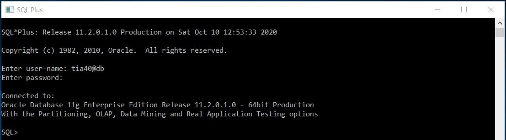
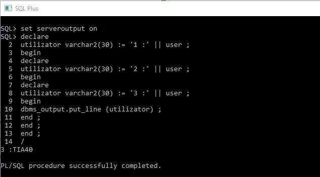

# Laborator PL/SQL 1

## Conectare
**Mod de lucru:** serverul de la facultate



## Exercitii

A. Care sunt declaratiile invalide ?

| interogare | rezultat |
|--|--|
| `nom_varA NUMBER(8) DEFAULT 10 ;` | valid |
| `nom_var VARCHAR2(20) NOT NULL ;` | invalid pt ca e declaratie e not null dar variabila nu e initializata |
| `nom_var BOOLEAN :=1 ;` | invalid pt ca booleanul are valori true sau false |
| `nom_var BINARY_INTEGER ;` | valid |
| `2nom_var BINARY_INTEGER ;` | invalid, numele de variabile nu incep cu cifre |
| `nom_varI NUMBER(3) :=123.45678 ;` | valid |
| `nom_var NUMBER(3) :=1234.5678 ;` | invalid, valoare nu poate fi memorata, number este declarat de 3 cifre |
| `nom_varK CONSTANT NUMBER(12,3) :=123.45678 ;` |  valid, numarul se rotunjeste |

---

 B. Care este rezultatul afişat de programul următor?
 


Rezultat: Numele urilizatorului curent

**ATENTIE:** trebuie executata comanda `set serveroutput on` pentru ca blocul sa poata afisa pe ecran

---
 
C. Creaţi un bloc PL/SQL în care declaraţi variabilele de la secţiunea A, punctele 1,6,8. Afişaţi informaţiile stocate în aceste variabile.

~~~sql
DECLARE
nom_varA NUMBER(8) DEFAULT 10; 
nom_varI NUMBER(3) :=123.45678; 
nom_varK CONSTANT NUMBER(12,3) :=123.45678;
BEGIN
dbms_output.put_line ('nom_varA = ' || nom_varA);
dbms_output.put_line ('nom_varI = ' || nom_varI);
dbms_output.put_line ('nom_varK = ' || nom_varK);
END;
/
~~~

**Rezultat**
```bash
nom_varA = 10
nom_varI = 123
nom_varK = 123.457
```

---

D. Care sunt expresiile valide care pot înlocui trei puncte din blocul următor?
```roomsql
declare
 v_1 emp%ROWTYPE ;
begin
…
end ;
/
```
| SQL | Rezultat |
|--|--|
| `SELECT * INTO v_1 FROM emp WHERE empno= 7900 ;` | valid - scoate din baza de date o inregistrare pe care o pune in v_1 |
| `UPDATE emp SET ROW=v_1 WHERE empno= 7900;` | invalid - in variabila v_1 nu exista date care sa poata fi introduce (mai ales ca empno are constrangeri de not null) |
| `SELECT COUNT(*) INTO v_1 FROM emp WHERE 1=2 ;` | nvalid - v_1 este de tipul unui rand din tabela emp, nu poate stoca un numar returnat de count |
| `SELECT * INTO v_1 FROM emp WHERE 1=2 ;` | invalid - variavila v_1 trebuie sa contina o inregistrare |
| `SELECT * INTO v_1 FROM emp ;` | invalid - variabila v_1 nu poate stoca mai mult de o inregistrare, iar subinterogarea returneaza toate randurile din emp  |
