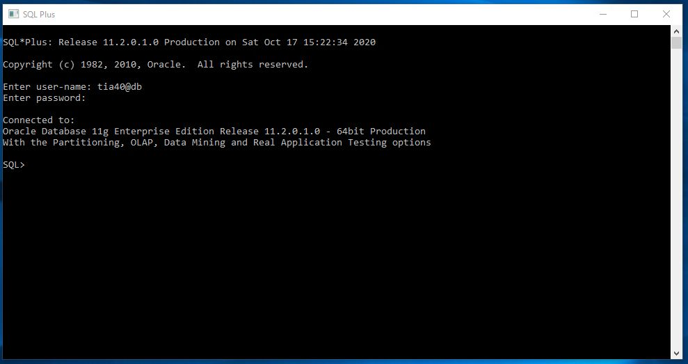
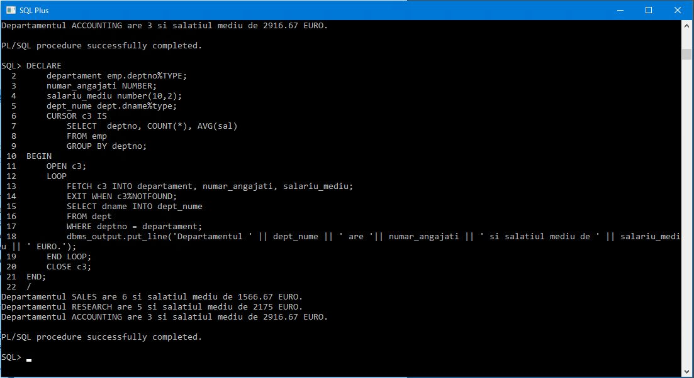
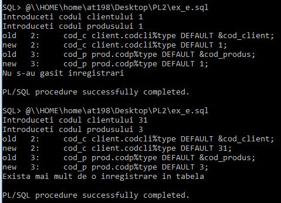
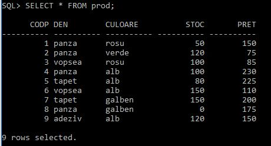
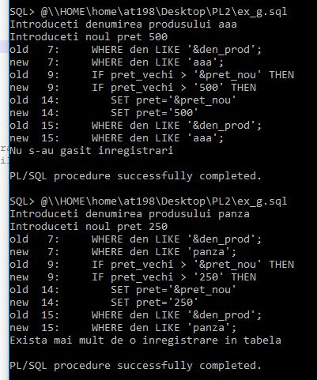
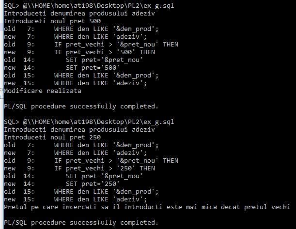
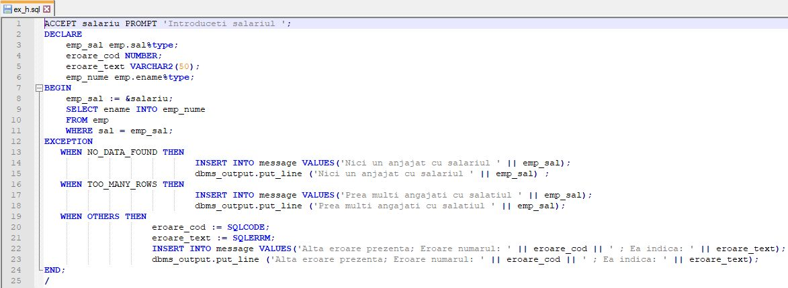
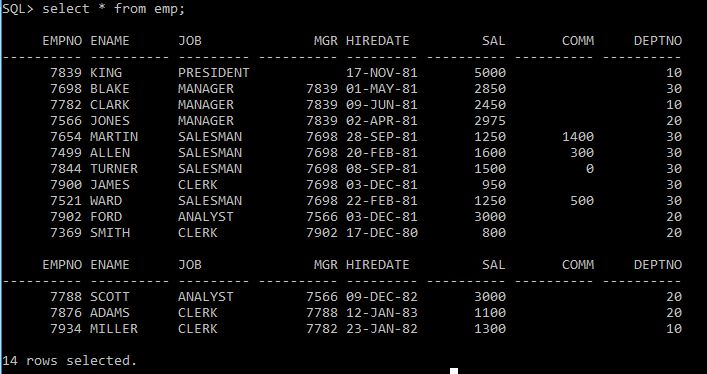
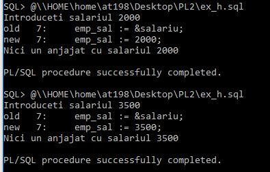
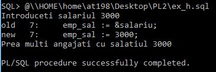

# Laborator PL/SQL 2

## Conectare
**Mod de lucru:** serverul de la facultate



## Setări inițiale
```sql
SQL> set serveroutput on
SQL> set line 300
```

`set serveroutput on` indica sistemului sa sa afiseze rezultatele pe ecran
`set line 300` indica cate caractere se pot afisa pe o linie
## Exercitii

A. Creaţi un bloc PL/SQL care afişează un calificativ pentru salariul fiecărui angajat (foarte bun, bun, destul de bun, deloc bun) după valoarea salariului înregistrat în tabelă.

```sql
DECLARE
    nume emp.ename%TYPE;
    salariu emp.sal%TYPE;
    CURSOR c2 IS
        SELECT ename, sal
        FROM emp;
BEGIN
    OPEN c2;
    LOOP
        FETCH c2 INTO nume, salariu;
        EXIT WHEN c2%NOTFOUND;
        CASE 
            WHEN salariu < 1000 THEN
                dbms_output.put_line(nume || ' are un salariu deloc bun');
            WHEN salariu BETWEEN 1000 AND 2000 THEN
                dbms_output.put_line(nume || ' are salariu destul de bun');
            WHEN salariu BETWEEN 2000 AND 3000 THEN
                dbms_output.put_line(nume || ' are salariu bun');
            ELSE
                dbms_output.put_line(nume || ' are salariu foarte bun');
         END CASE;
    END LOOP;
    CLOSE c2;
END;
/
```

Rezultat:
```sql
KING are salariu foarte bun
BLAKE are salariu bun
CLARK are salariu bun
JONES are salariu bun
MARTIN are salariu destul de bun
ALLEN are salariu destul de bun
TURNER are salariu destul de bun
JAMES are un salariu deloc bun
WARD are salariu destul de bun
FORD are salariu bun
SMITH are un salariu deloc bun
SCOTT are salariu bun
ADAMS are salariu destul de bun
MILLER are salariu destul de bun
```

---

B. Calculaţi şi afişaţi salariul mediu şi numărul de angajaţi pentru fiecare departament.

```sql
DECLARE
    departament emp.deptno%TYPE;
    numar_angajati NUMBER;
    salariu_mediu number(10,2);
    dept_nume dept.dname%type;
    CURSOR c3 IS
        SELECT  deptno, COUNT(*), AVG(sal)
        FROM emp
        GROUP BY deptno;
BEGIN
    OPEN c3;
    LOOP
        FETCH c3 INTO departament, numar_angajati, salariu_mediu;
        EXIT WHEN c3%NOTFOUND;
        SELECT dname INTO dept_nume
        FROM dept
        WHERE deptno = departament;
        dbms_output.put_line('Departamentul ' || dept_nume || ' are '|| numar_angajati || ' si salatiul mediu de ' || salariu_mediu || ' EURO.');
    END LOOP;
    CLOSE c3;
END;
/
```

Rezultat:
```sql 
Departamentul SALES are 6 si salatiul mediu de 1566.67 EURO.
Departamentul RESEARCH are 5 si salatiul mediu de 2175 EURO.
Departamentul ACCOUNTING are 3 si salatiul mediu de 2916.67 EURO.
```



---

C. Creaţi un bloc PL/SQL care utilizează un cursor parametrizat pentru afişarea, mai întâi, a şirului iniţialelor angajaţilor departamentului 10, iar apoi şirul cu ultimele litere ale angajaţilor departamentului 20. 


```sql 
DECLARE
    CURSOR c (parametru number) IS
    SELECT ename FROM emp where deptno=parametru;
BEGIN
    Dbms_output.put_line('Departament 10:');
    FOR v_ename IN c(10) LOOP
        Dbms_output.put_line(substr(v_ename.ename,1,1));
    END LOOP;
    Dbms_output.put_line('Departament20:');
    FOR v_ename IN c(20) LOOP
        Dbms_output.put_line(substr(v_ename.ename,-1,1));
    END LOOP;
END;
/
```

Rezultat:
```sql
Departament 10:
K
C
M
Departament20:
S
D
H
T
S
```

---
D. Creaţi o tabelă de comentarii (două coloane: nume şi observatii) unde înregistraţi, cu ajutorul unui bloc PL/SQL, comentarii la salariul fiecărui angajat, faţă de salariul mediu al departamentului lui, de exemplu :
- salariul lui X este cel putin dublul salariului mediu
- salariul lui X este cel putin de 3 ori salariul mediu
- salariul lui X nu este mai mult ca dublul salariului mediu
- salariul lui X este mai mic decat salariul mediu 

```sql 
CREATE TABLE EMP_COMENTARII 
(
  NUME VARCHAR2(20),
  COMENTARIU VARCHAR2(200) 
);

DECLARE
    sal_mediu emp.sal%TYPE;
    CURSOR c7(nr_dep number) IS
        SELECT AVG(sal)
        FROM emp
        WHERE deptno = nr_dep;
BEGIN
    FOR var IN (SELECT ename, sal, deptno FROM emp) LOOP
        OPEN c7(var.deptno);
        FETCH c7 INTO sal_mediu;
        CLOSE c7;
        IF( var.sal < sal_mediu) THEN
            INSERT INTO emp_comentarii VALUES (var.ename, 'este mai mic decat salariul mediu');
        ELSE IF( var.sal < sal_mediu * 2 ) THEN
                INSERT INTO emp_comentarii VALUES (var.ename, 'nu este mai mult ca dublul salariului mediu');
            ELSE IF( var.sal < sal_mediu * 3) THEN
                    INSERT INTO emp_comentarii VALUES (var.ename, 'este cel putin dublul salariului mediu');
                ELSE
                    INSERT INTO emp_comentarii VALUES (var.ename, 'este cel putin de 3 ori salariul mediu');
                END IF;
            END IF;
        END IF;
    END LOOP;
END;
/
```

Rezultat:
```sql 
SQL> SELECT 'Salariul lui ' || nume || ' ' || comentariu AS COMENTARII FROM emp_comentarii;

COMENTARII
----------------------------------------------------------------------
Salariul lui KING nu este mai mult ca dublul salariului mediu
Salariul lui BLAKE nu este mai mult ca dublul salariului mediu
Salariul lui CLARK este mai mic decat salariul mediu
Salariul lui JONES nu este mai mult ca dublul salariului mediu
Salariul lui MARTIN este mai mic decat salariul mediu
Salariul lui ALLEN nu este mai mult ca dublul salariului mediu
Salariul lui TURNER este mai mic decat salariul mediu
Salariul lui JAMES este mai mic decat salariul mediu
Salariul lui WARD este mai mic decat salariul mediu
Salariul lui FORD nu este mai mult ca dublul salariului mediu
Salariul lui SMITH este mai mic decat salariul mediu
Salariul lui SCOTT nu este mai mult ca dublul salariului mediu
Salariul lui ADAMS este mai mic decat salariul mediu
Salariul lui MILLER este mai mic decat salariul mediu

14 rows selected.
```

---

E. Creaţi un bloc PL/SQL care:
1. citeşte două valori introduse la tastatură reprezentând codul unui client (corespunzator tabelei CLIENT) şi codul unui produs (corespunzator tabelei PROD),
2. afişează cantitatea din acel produs cumparat de acel client
3. scrieţi codul PL/SQL care să permită generarea fiecăreia din excepţiile următoare :
    - NO_DATA_FOUND
    - TOO_MANY_ROWS
    - INVALID_NUMBER
    - precum şi ultima alternativă, pentru toate celelalte erori.
   
Prin execuţii repetate, cu diferite valori, faceţi să se declanşeze secvenţele de tratare a excepţiilor.

Continutul fisierului _**ex_e.sql**_
```sql
ACCEPT cod_client PROMPT 'Introduceti codul clientului ';
ACCEPT cod_produs PROMPT 'Introduceti codul produsului ';

DECLARE
    cod_c client.codcli%type DEFAULT &cod_client;
    cod_p prod.codp%type DEFAULT &cod_produs;
    cantitate vanzare.cant%type;
BEGIN
     SELECT cant INTO cantitate
     FROM vanzare
     WHERE codcli = cod_c
     AND codp = cod_p;
     dbms_output.put_line('Cantitatea comparata: ' || cantitate);  
EXCEPTION
   WHEN NO_DATA_FOUND THEN dbms_output.put_line ('Nu s-au gasit inregistrari') ;
   WHEN TOO_MANY_ROWS  THEN dbms_output.put_line ('Exista mai mult de o inregistrare in tabela') ;
   WHEN INVALID_NUMBER THEN dbms_output.put_line ('Sirul de caractere nu poate fie convertit la number') ;
   WHEN OTHERS THEN dbms_output.put_line ('Alte erori') ;
END;
/
```

Rezultat:



---

G. Creaţi un bloc PL/SQL pentru modificarea unui pret pentru un produs (indicat prin denumire). Controlaţi că noul pret nu este superior celui vechi; dacă da, atunci declanşaţi o excepţie.
În acelaşi timp, prevedeţi secvenţe pentru tratarea altor excepţii: produsul nu exista (NO_DATA_FOUND), există mai multe produse cu aceeaşi denumire (TOO_MANY_ROWS).

Continutul fisierului _**ex_g.sql**_
```sql 
ACCEPT den_prod PROMPT 'Introduceti denumirea produsului ';
ACCEPT pret_nou PROMPT 'Introduceti noul pret ';

DECLARE
	pret_vechi prod.pret%type;
    eroare_pret_mic EXCEPTION;
BEGIN
    SELECT pret INTO pret_vechi
    FROM prod
    WHERE den LIKE '&den_prod';
	
    IF pret_vechi > '&pret_nou' THEN
        RAISE eroare_pret_mic;
	END IF;
	
    UPDATE prod 
	SET pret='&pret_nou'
    WHERE den LIKE '&den_prod';
	
    dbms_output.put_line('Modificare realizata');	
EXCEPTION
   WHEN NO_DATA_FOUND THEN dbms_output.put_line ('Nu s-au gasit inregistrari') ;
   WHEN TOO_MANY_ROWS  THEN dbms_output.put_line ('Exista mai mult de o inregistrare in tabela') ;
   WHEN eroare_pret_mic THEN dbms_output.put_line ('Pretul pe care incercati sa il introducti este mai mica decat pretul vechi') ;
   WHEN OTHERS THEN dbms_output.put_line ('Alte erori') ;
END;
/
```

Rezultat:







---

H. Creaţi o tabelă, MESSAGE, cu o singură coloană, de tip text.
Craţi un bloc PL/SQL care citeşte o valoare de la tastatură, reprezentând un salariu, şi apoi caută în tabela emp, angajaţii cu acel salariu.
1. dacă sunt returnate mai multe linii, să se înscrie în tabela MESSAGE textul _prea mulţi angajaţi cu salariul …_.
2. dacă nu este returnată nicio linie, lorsque aucune ligne n'est retournée, să se înscrie în tabela MESSAGE textul _niciun angajat cu salariul …_.
3. la apariţia unei alte erori, să se înscrie în tabela MESSAGE textul _altă eroare este prezentă; eroarea numărul … care indică …_.

Verificaţi prin execuţii succesive, cu diferite valori.

```sql
SQL> CREATE TABLE MESSAGE
  2  (
  3    ERROR_TEXT VARCHAR2(200)
  4  );

Table created.
```

Continutul fisierului _**ex_h.sql**_
```sql
ACCEPT salariu PROMPT 'Introduceti salariul';
DECLARE
    emp_sal emp.sal%type;
    eroare_cod NUMBER;
    eroare_text VARCHAR2(50); 
    emp_nume emp.ename%type;
BEGIN
    emp_sal := &salariu;
    SELECT ename INTO emp_nume
    FROM emp
    WHERE sal = emp_sal;
EXCEPTION
   WHEN NO_DATA_FOUND THEN 
                            INSERT INTO message VALUES('Nici un anjajat cu salariul ' || emp_sal);
                            dbms_output.put_line ('Nici un anjajat cu salariul ' || emp_sal) ;
   WHEN TOO_MANY_ROWS THEN 
                            INSERT INTO message VALUES('Prea multi angajati cu salatiul ' || emp_sal);   
                            dbms_output.put_line ('Prea multi angajati cu salatiul ' || emp_sal);
   WHEN OTHERS THEN 
                    eroare_cod := SQLCODE;
                    eroare_text := SQLERRM;
                    INSERT INTO message VALUES('Alta eroare prezenta; Eroare numarul: ' || eroare_cod || ' ; Ea indica: ' || eroare_text);
                    dbms_output.put_line ('Alta eroare prezenta; Eroare numarul: ' || eroare_cod || ' ; Ea indica: ' || eroare_text);
END;
/
```



Rezultat:







```sql
SQL> select * from message;

ERROR_TEXT
----------------------------------------
Nici un anjajat cu salariul 2000
Nici un anjajat cu salariul 3500
Prea multi angajati cu salatiul 3000
```
