# Laborator PL/SQL 3

## Conectare

**Mod de lucru:** serverul de la facultate

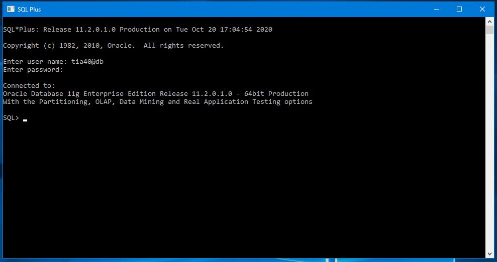

## Setări inițiale

```sql
SQL> set serveroutput on
SQL> set line 200
```

`set serveroutput on` indica sistemului sa sa afiseze rezultatele pe ecran

`set line 200` indica cate caractere se pot afisa pe o linie

## Exercitii

A. Creati o noua tabela, SPION, cu o coloana numerica (pentru care definiti o secventa) si o coloana text.

Creati diversi declansatori pentru cele patru posibilitati urmatoare: Declansator inainte nivel comanda, declansator inainte nivel linie, declansator dupa nivel comanda, declansator dupa nivel linie; ei vor inregistra in tabela SPION numarul urmator generat de secventa, precum si textul potrivit situatiei: " inainte nivel comanda ", " inainte nivel linie ", " dupa nivel comanda ", " dupa nivel linie ".

Creati un script cu instrutiuni LMD care prodvoaca declansarea acestor declansatori si, in acelasi timp, inregistrati in tabela SPION.

Analizati continutul tabelei SPION.


---

B. Creati un declansator care semnaleaza momentul cand se inregistreaza un comision pentru un angajat care nu este "salesman".

**_Cod declansator:_**
```sql 
CREATE OR REPLACE TRIGGER inregistrare_comision_eronat 
BEFORE UPDATE ON EMP FOR EACH ROW
DECLARE 
    emp_job emp.job%TYPE;
BEGIN
    SELECT job INTO emp_job
    FROM emp
    WHERE empno = :OLD.empno;
    IF emp_job <> 'SALESMAN' AND :NEW.job <> 'SALESMAN' THEN
        dbms_output.put_line(chr(10) || 'Angajatul nu este SALESMAN ');
        ROLLBACK;
    END IF;
END;
/
```

**_Cod apelare procedura:_**
```sql 
UPDATE emp SET comm = 500 WHERE empno = 7839;
```

**_Rezultat:_**

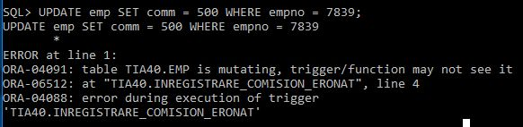

---

C. Creaţi o procedură PL/SQL pentru calcularea şi afişarea sumei salariilor la un departament, al cărui nume este citit de la tastatură. Lansaţi procedura sub SQLPlus.

**_Cod procedura:_**
```sql 
CREATE OR REPLACE PROCEDURE salarii(dept_nume in dept.dname%TYPE, suma_sal out emp.sal%TYPE)
IS
    BEGIN
        SELECT sum(sal) INTO suma_sal
         FROM emp, dept
         WHERE emp.deptno=dept.deptno
         AND dname = UPPER(dept_nume);
     EXCEPTION
      WHEN NO_DATA_FOUND THEN suma_sal := 0;
END;
/
```

**_Cod apelare procedura:_**
```sql 
ACCEPT nume_departament PROMPT 'Introduceti numele departamentului ';
DECLARE
    dept_nume dept.dname%TYPE := '&nume_departament';
    rezultat emp.sal%type := 0;
BEGIN
    salarii(dept_nume, rezultat);
    IF rezultat <> 0 THEN
        dbms_output.put_line (chr(10) || 'Suma salariilor departamentului ' || dept_nume || ' este ' || rezultat);
    ELSE 
        dbms_output.put_line (chr(10) || 'Nu exista departamentul ' || dept_nume);
    END IF;
END;
/
```

**_Rezultat:_**

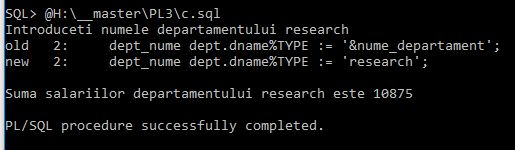

---

D. Creaţi un bloc PL/SQL pentru afişarea sumei salariilor la un departament, al cărui nume este citit de la tastatură. Utilizaţi pentru acest calcul, o funcţie definită local, la nivelul blocului.

**_Cod functie:_**
```sql 
CREATE OR REPLACE FUNCTION salarii_D(dept_nume dept.dname%TYPE) RETURN emp.sal%TYPE IS
     suma_sal emp.sal%TYPE DEFAULT 0;
     BEGIN
        SELECT sum(sal) INTO suma_sal
        FROM emp, dept
        WHERE emp.deptno=dept.deptno
        AND UPPER(dname) = UPPER(dept_nume);
        RETURN suma_sal;
    EXCEPTION
        WHEN NO_DATA_FOUND THEN RETURN 0;
END;
/
```

**_Cod apelare functie:_**
```sql 
ACCEPT nume_departament PROMPT 'Introduceti numele departamentului';
DECLARE
    dept_nume dept.dname%TYPE DEFAULT '&nume_departament';
    rezultat emp.sal%type DEFAULT 0;
BEGIN
    rezultat := salarii_D(dept_nume);
    IF rezultat <> 0 THEN
        dbms_output.put_line (chr(10) || 'Suma salariilor departamentului ' || dept_nume || ' este ' || rezultat) ;
    ELSE 
        dbms_output.put_line (chr(10) || 'Nu exista departamentul ' || dept_nume) ;
    END IF;
END;
/
```

**_Rezultat:_**

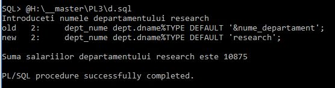

---

E. Creaţi un bloc PL/SQL pentru afişarea celui mai mic salariu mediu între două departamente ale căror nume sunt citite de la tastatură. Utilizaţi pentru calculul salariului mediu o funcţie definită local, la nivelul blocului.

**_Cod functie:_**
```sql 
CREATE OR REPLACE FUNCTION salariu_mediu(dept_nume dept.dname%TYPE) RETURN emp.sal%TYPE IS
     medie_sal emp.sal%TYPE DEFAULT 0;
     BEGIN
        SELECT AVG(sal) INTO medie_sal
        FROM emp, dept
        WHERE emp.deptno=dept.deptno
        AND UPPER(dname) = UPPER(dept_nume);
        RETURN medie_sal;
    EXCEPTION
        WHEN NO_DATA_FOUND THEN RETURN 0;
END;
/
```

**_Cod apelare functie:_**
```sql 
ACCEPT nume_departament1 PROMPT 'Introduceti numele departamentului ';
ACCEPT nume_departament2 PROMPT 'Introduceti numele departamentului ';
DECLARE
    dept_nume1 dept.dname%TYPE DEFAULT '&nume_departament1';
    dept_nume2 dept.dname%TYPE DEFAULT '&nume_departament2';
    rezultat2 emp.sal%type DEFAULT 0;
    rezultat1 emp.sal%type DEFAULT 0;
BEGIN
    rezultat1 := salariu_mediu(dept_nume1);
    rezultat2 := salariu_mediu(dept_nume2);
    IF rezultat1 < rezultat2 THEN
        dbms_output.put_line (chr(10) || 'Departamentul ' || UPPER(dept_nume1) || ' are cel mai mic salatiu mediu in valoare de ' || rezultat1);
    ELSE 
        dbms_output.put_line (chr(10) || 'Departamentul ' || UPPER(dept_nume2) || ' are cel mai mic salatiu mediu in valoare de ' || rezultat2);
    END IF;
END;
/
```

**_Rezultat:_**

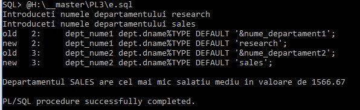

---

F. Repetaţi problema precedentă, utilizând in loc de funcţie, o procedură care transmite rezultatul printr-un parametru de ieşire.

**_Cod procedura:_**
```sql 
CREATE OR REPLACE PROCEDURE salariu_mediu_proc(dept_nume IN dept.dname%TYPE, medie_sal OUT emp.sal%TYPE) 
IS
     BEGIN
        SELECT AVG(sal) INTO medie_sal
        FROM emp, dept
        WHERE emp.deptno=dept.deptno
        AND UPPER(dname) = UPPER(dept_nume);
    EXCEPTION
        WHEN NO_DATA_FOUND THEN medie_sal := 0;
END;
/
```

**_Cod apelare procedura:_**
```sql 
ACCEPT nume_departament1 PROMPT 'Introduceti numele departamentului ';
ACCEPT nume_departament2 PROMPT 'Introduceti numele departamentului ';
DECLARE
    dept_nume1 dept.dname%TYPE DEFAULT '&nume_departament1';
    dept_nume2 dept.dname%TYPE DEFAULT '&nume_departament2';
    rezultat2 emp.sal%type DEFAULT 0;
    rezultat1 emp.sal%type DEFAULT 0;
BEGIN
    salariu_mediu_proc(dept_nume1, rezultat1);
    salariu_mediu_proc(dept_nume2, rezultat2);
    IF rezultat1 < rezultat2 THEN
        dbms_output.put_line (chr(10) || 'Departamentul ' || UPPER(dept_nume1) || ' are cel mai mic salatiu mediu in valoare de ' || rezultat1);
    ELSE 
        dbms_output.put_line (chr(10) || 'Departamentul ' || UPPER(dept_nume2) || ' are cel mai mic salatiu mediu in valoare de ' || rezultat2);
    END IF;
END;
/
```

**_Rezultat:_**

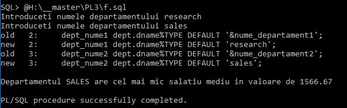

---
 
G. Craţi un bloc PL/SQL pentru afişarea angajaţilor cu salariul superior salariului mediu din departamentul lor. Utilizaţi pentru calculul salariului mediu o funcţie definită local, la nivelul blocului.

**_Cod functie:_**

- se utilizeaza functia definita anterior (la punctul E)

**_Cod apelare functie:_**
```sql 
DECLARE
    rezultat emp.sal%type DEFAULT 0;
    CURSOR c1 IS
        SELECT dname
        FROm dept;
    CURSOR c2(cod varchar2) IS
        SELECT ename, sal 
        FROM emp, dept
        WHERE emp.deptno = dept.deptno
        AND dname LIKE cod;
BEGIN
    FOR var IN c1 LOOP
        rezultat := salariu_mediu(var.dname);
        FOR k IN c2(var.dname) LOOP
            IF k.sal > rezultat THEN
                dbms_output.put_line ('Angajatul ' || UPPER(k.ename) || ' cu salariul ' || k.sal || ' detine salariul peste media departamentului ' || var.dname);
            END IF;
        END LOOP;
    END LOOP;
END;
/
```

**_Rezultat:_**

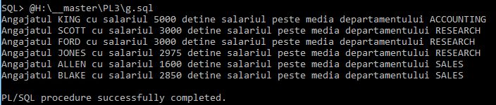

---

H. Repetaţi problema precedentă, utilizând in loc de funcţie, o procedură care transmite rezultatul printr-un parametru de ieşire.

**_Cod procedura:_**

- se utilizeaza procedura definita anterior (la punctul F)

**_Cod apelare procedura:_**
```sql 
DECLARE
    rezultat emp.sal%type DEFAULT 0;
    CURSOR c1 IS
        SELECT dname
        FROm dept;
    CURSOR c2(cod varchar2) IS
        SELECT ename, sal 
        FROM emp, dept
        WHERE emp.deptno = dept.deptno
        AND dname LIKE cod;
BEGIN
    FOR var IN c1 LOOP
        salariu_mediu_proc(var.dname, rezultat);
        FOR k IN c2(var.dname) LOOP
            IF k.sal > rezultat THEN
                dbms_output.put_line ('Angajatul ' || UPPER(k.ename) || ' cu salariul ' || k.sal || ' detine salariul peste media departamentului ' || var.dname);
            END IF;
        END LOOP;
    END LOOP;
END;
/
```

**_Rezultat:_**

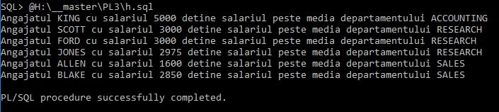

---
 
I. Creaţi o funcţie PL/SQL pentru calculul salariului mediu a tuturor angajaţilor şi apoi, cu o comandă SQL, afişaţi toţi angajaţii care au salariul mai mic decât media.

**_Cod functie:_**
```sql 
CREATE OR REPLACE FUNCTION salariu_mediu_complet_functie RETURN emp.sal%TYPE IS
    sal_mediu NUMBER := 0;
    BEGIN
        SELECT AVG(sal)INTO sal_mediu
        FROM emp;
        -- dbms_output.put_line(sal_mediu);
        RETURN sal_mediu;
    EXCEPTION
        WHEN NO_DATA_FOUND THEN sal_mediu := 0;
        RETURN sal_mediu;
END;
/
```

**_Cod apelare functie:_**
```sql 
SELECT * FROM emp
WHERE sal < salariu_mediu_complet_functie;
```

**_Rezultat:_**

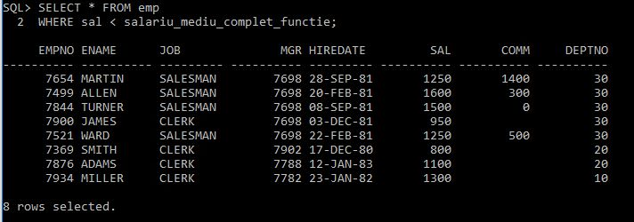

---

J. Creaţi un pachet pentru gestiunea angajaţilor, cu următoarele posibilităţi:
- o funcţie care controlează existenţa unui angajat în tabela emp, plecând de la codul lui
- o procedură de eliminare a unui angajat
- o procedură cu doi parametri care măreşte salariul unui angajat (prevedeţi o excepţie pentru absenţa angajatului şi pentru valoarea 0 a sumei cu care se măreşte salariul; în acest caz, angajatul va primi salariul mediu).

Creaţi un script pentru validarea acestor subprograme. 

**_Cod functie si proceduri:_**
```sql 
CREATE OR REPLACE FUNCTION emp_exist(id_emp emp.empno%TYPE) RETURN BOOLEAN 
IS
    nr_emp NUMBER := 0;
    BEGIN
        SELECT count(*) INTO nr_emp
        FROM emp
        WHERE empno = id_emp;
        IF nr_emp <> 1 THEN
            RETURN false;
        END IF;
        RETURN true;
END;
/

CREATE OR REPLACE PROCEDURE eliminare_emp(id_emp IN emp.empno%TYPE) 
IS
    next_mgr emp.mgr%TYPE;
     BEGIN
        SELECT mgr INTO next_mgr
        FROM emp
        WHERE empno = id_emp;

        UPDATE emp
        SET mgr = next_mgr
        WHERE mgr = id_emp;

        DELETE FROM emp
        WHERE empno = id_emp;
    EXCEPTION
        WHEN NO_DATA_FOUND THEN dbms_output.put_line('Angajatul cu codul ' || id_emp || ' nu exista!');
END;
/

CREATE OR REPLACE PROCEDURE marire_salariu_emp(id_emp IN emp.empno%TYPE, add_sal IN emp.sal%TYPE) 
IS
    sal_mediu emp.sal%TYPE DEFAULT 0;
     BEGIN
        IF emp_exist(id_emp) THEN
            IF add_sal > 0 THEN
                UPDATE emp SET sal = sal + add_sal WHERE empno = id_emp;
            ELSE
                sal_mediu := salariu_mediu_complet_functie();
                UPDATE emp SET sal = sal_mediu WHERE empno = id_emp;
            END IF;
        ELSE 
            dbms_output.put_line('Angajatul cu codul ' || id_emp || ' nu exista!');
        END IF;
END;
/

select * from user_errors where name=upper('marire_salariu_emp');
```

**_Cod apelare procedura:_**
```sql 
DECLARE
    rezultat BOOLEAN;
BEGIN
    rezultat := emp_exist(1);
    IF rezultat THEN
        dbms_output.put_line('Angajatul cu codul 1 exista!');
    ELSE
        dbms_output.put_line('Angajatul cu codul 1 nu exista!');
    END IF;
END;
/

BEGIN
    eliminare_emp(7902);
END;
/

BEGIN
    marire_salariu_emp(7698, 500);
    marire_salariu_emp(7782, 0);
    marire_salariu_emp(5, 500);
END;
/

```

**_Rezultat:_**

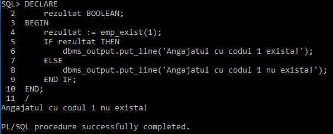

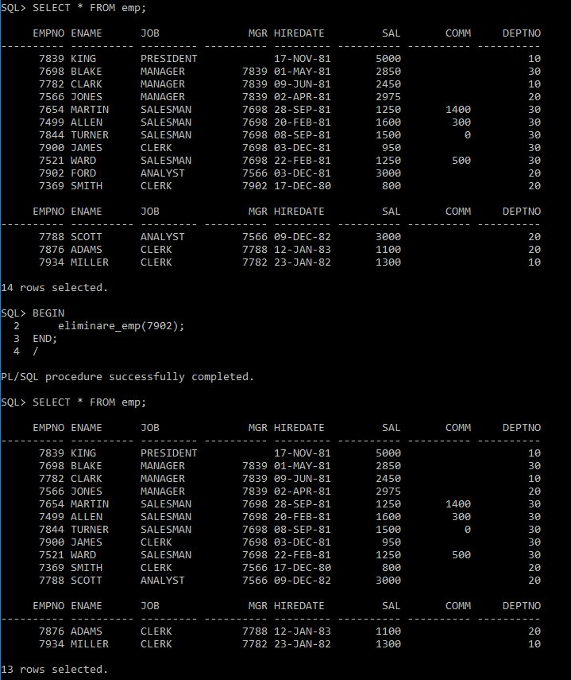

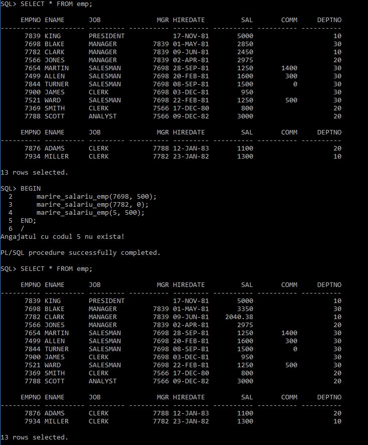