# Laborator PL/SQL - Tranzacții

## Conectare

**Mod de lucru:** serverul de la facultate

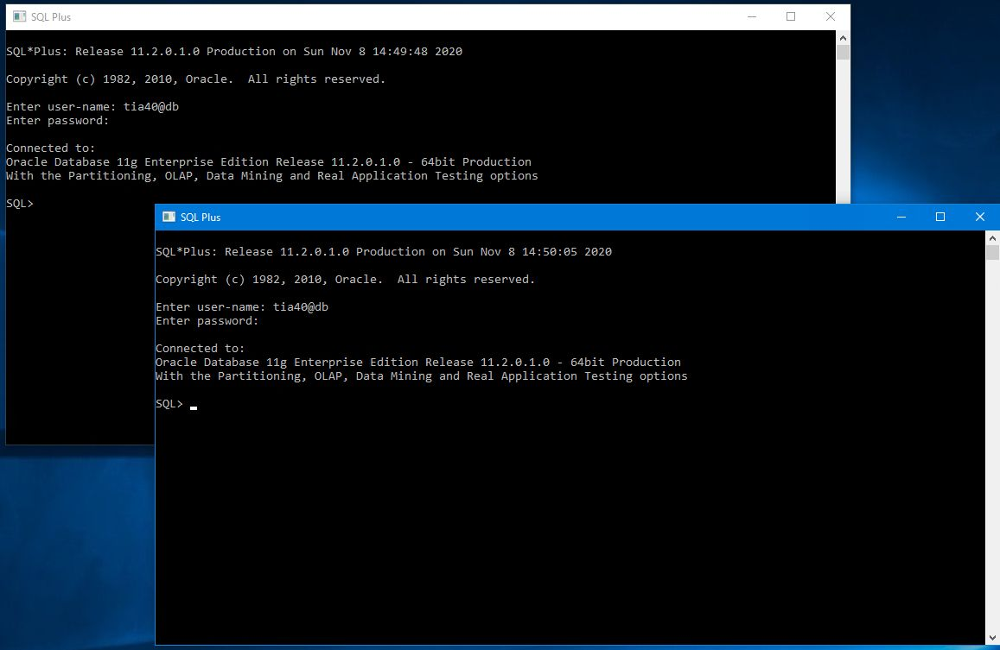

## Setări inițiale

```sql
SQL> set serveroutput on
SQL> set line 200
```

`set serveroutput on` indica sistemului sa sa afiseze rezultatele pe ecran

`set line 200` indica cate caractere se pot afisa pe o linie

## Exercitii

A. Urmăriți derularea tranzacțiilor în situațiile următoare:

1
| T1 | T2 |
|--|--|
| `select * from emp;` | `select * from emp;` |
| `update emp
set sal=sal*1.1;` | |
| `insert into emp (empno, sal, deptno)
values (3, 12000, 20);` | | 
| `select * from emp;` | `select * from emp;` |
| `commit;` | |
| `select * from emp;` | `select * from emp;` |
| `delete from emp
where deptno=20;` | |
| `select * from emp;` | `select * from emp;` |
| `rollback` | |
| `select * from emp;` | `select * from emp;` |

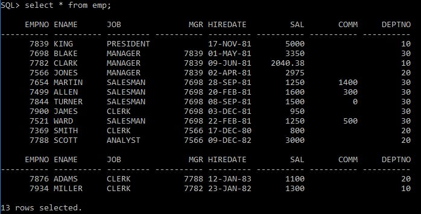

Daca trigger-ele sunt activate pe tabela emp, e posibil sa nu se poata face update-ul la intreaga tabela. Pentru a se rezolva aceste "erori" se dezactiveaza trigger-ele.

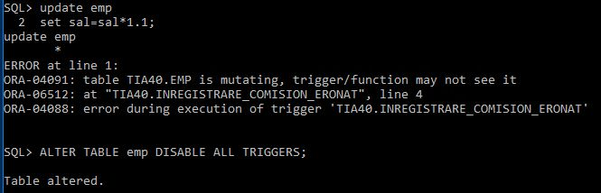

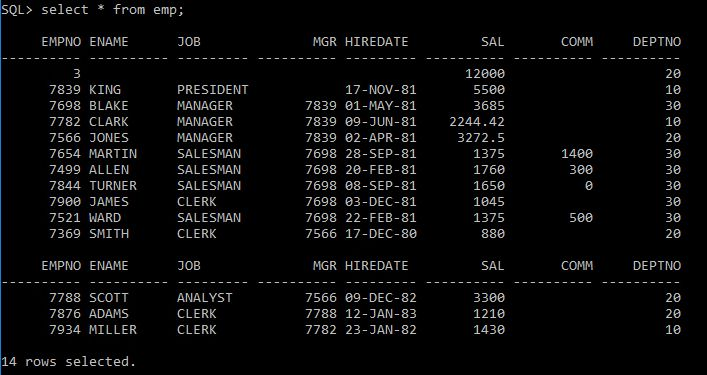

---

2
```sql
INSERT INTO emp (empno,ename, deptno)
 VALUES (222, 'ION', 40);
UPDATE emp SET ename='VASILE'
 WHERE empno=7900;
begin
 INSERT INTO emp (empno,ename, deptno)
 VALUES (333, 'MARIN', 40);
end;
/
DELETE FROM emp WHERE empno=7900;
ROLLBACK;
SELECT * FROM emp;
```

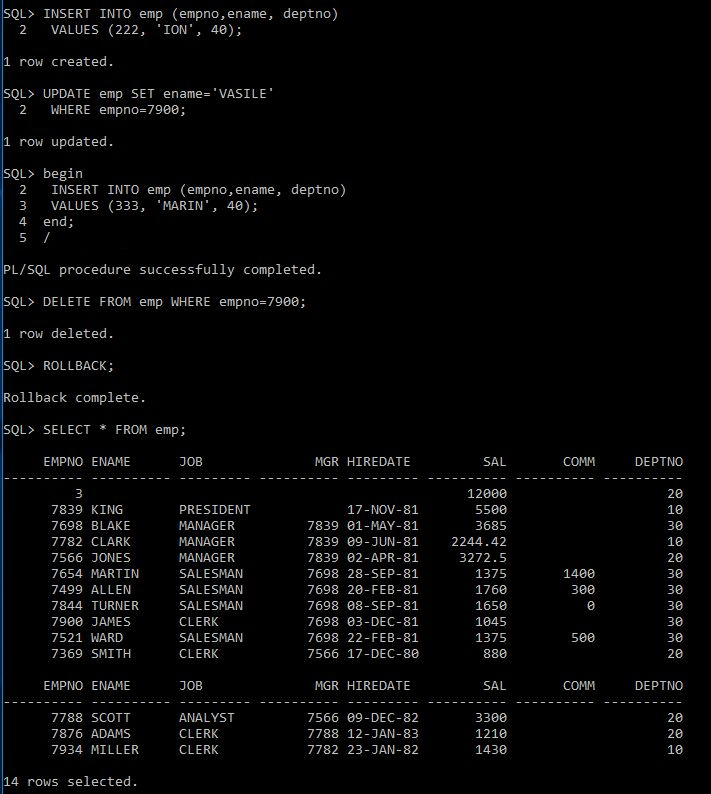

---

3
```sql
INSERT INTO emp (empno,ename, deptno)
 VALUES (222, 'ION', 40);
UPDATE emp SET ename='VASILE'
 WHERE empno=7900;
begin
 INSERT INTO emp (empno,ename, deptno)
 VALUES (333, 'MARIN', 40);
end;
/
DELETE FROM emp WHERE empno=7900;
COMMIT;
SELECT * FROM emp; 
```

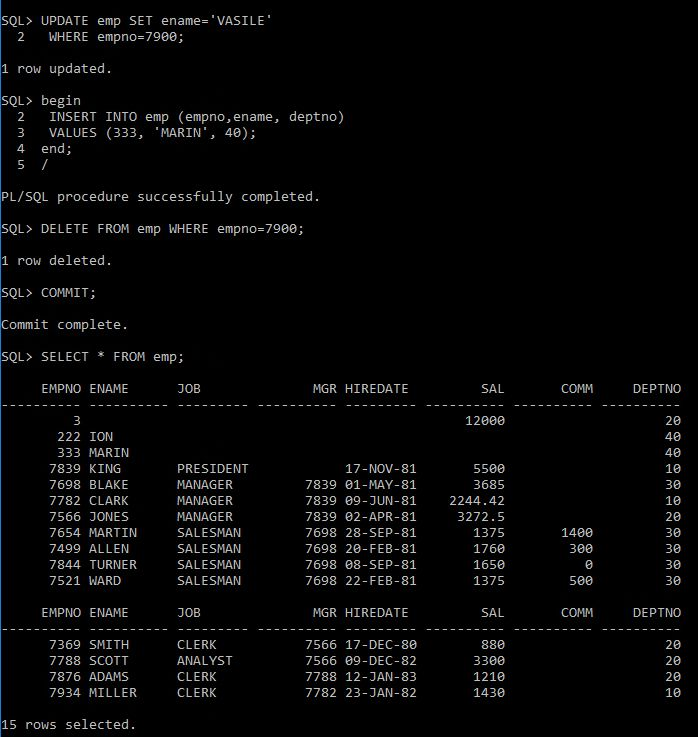

---

4
```sql
CREATE OR REPLACE PROCEDURE p1 IS
BEGIN
 INSERT INTO emp (empno, ename, deptno)
 VALUES (100, 'AVRAM', 40);
END;
/
CREATE OR REPLACE PROCEDURE p2 IS
BEGIN
 INSERT INTO emp (empno, ename, deptno)
 VALUES (200, 'APOSTOL', 40);
END;
/
BEGIN
p1;
p2;
ROLLBACK;
END;
/
SELECT * FROM emp;
```

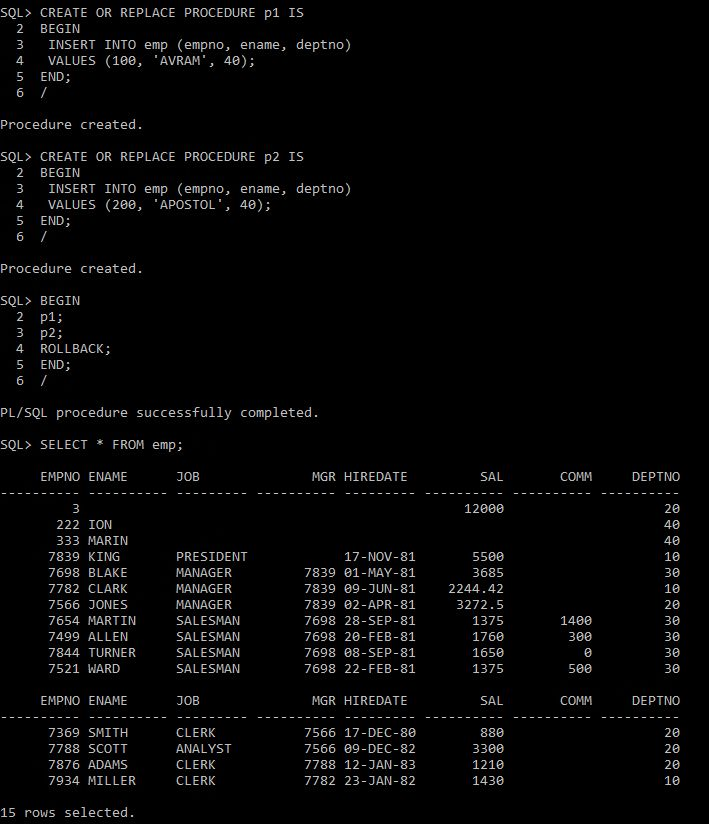

---

5
```sql
BEGIN
p1;
p2;
COMMIT;
END;
/
SELECT * FROM emp;
```

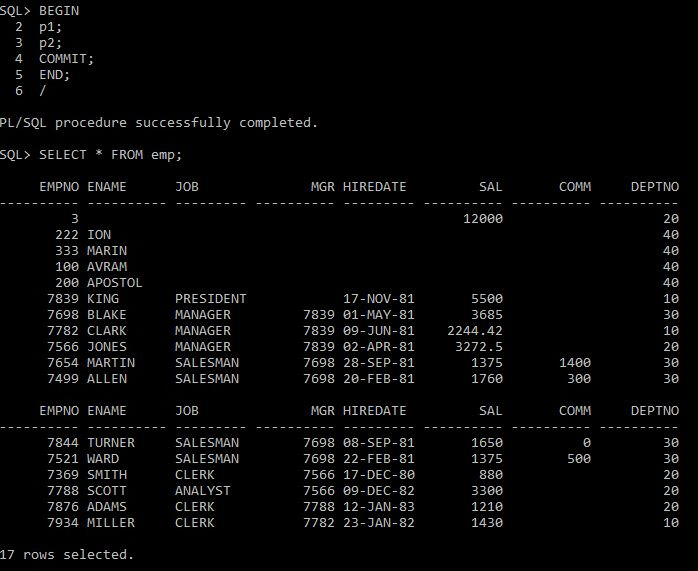

---

6
```sql
CREATE OR REPLACE PROCEDURE p3 IS
 PRAGMA AUTONOMOUS_TRANSACTION;
BEGIN
 INSERT INTO emp (empno, ename, deptno)
 VALUES (201, 'ANTON', 40);
 COMMIT;
END;
/
BEGIN
p1;
p3;
ROLLBACK;
END;
/
SELECT * FROM emp;
```

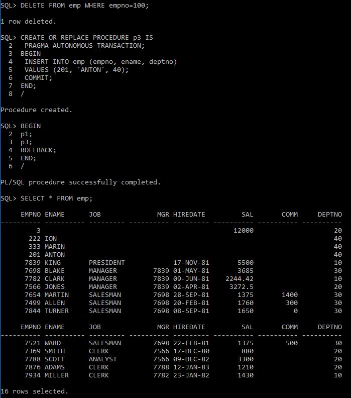

---

7
```sql
BEGIN
p1;
p3;
COMMIT;
END;
/
SELECT * FROM emp; 
```

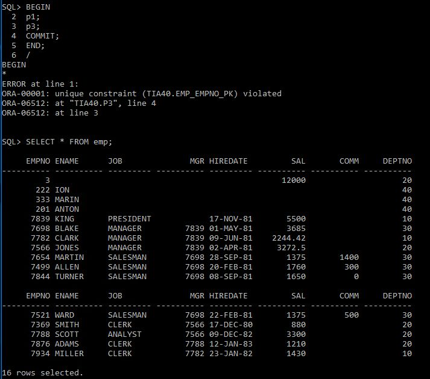

---

8
```sql
T1
UPDATE dept set dname =‘PAZA’ WHERE deptno=10;
-- blocare pe dept
```
```sql
T2
DECLARE
 CURSOR c_an IS
 SELECT * FROM emp where job='ANALYST' FOR UPDATE;
BEGIN
 OPEO c_an;
 UPDATE dept SET loc='PARIS' WHERE deptno=10;
 ROLLBACK;
 CLOSE c_an;
END;
/
```
```sql
T3
UPDATE emp set ename ='FLEURY' WHERE empno=7902;
-- asteptare din cauza blocarii pe emp (7902 este analist)
```
```sql
T1
COMMIT;
```

T1: 
1 row updated.

T2: 
Executia este blocata, pentru ca T1 a blocat tabela dept, si update-ul de la T2 nu poate realiza update-ul

T3: 
Executia este blocata pentru ca deschiderea cursorului blocheaza tabela emp (cursorul fiind deschis explicit pentru update)

T1: 
In momentul in care se executa comanda commit, tabela dept este eliberata, tranzactia 2 se ppoate realiza/ termina de executat si la inchiderea cursorului este eliberata tabela emp si in concluzie, tranzactia 3 se poate executa.

---

B
Creati tabelele:

BENEF (Nrben, nume, loc)
```sql
CREATE TABLE BENEF 
(
  	NRBEN NUMBER NOT NULL, 
	NUME VARCHAR2(20 BYTE) NOT NULL,
	LOC VARCHAR2(20 BYTE) NOT NULL,
	CONSTRAINT BENEF_PK PRIMARY KEY (NRBEN)
);
```
SERVICIU (Nrser, den, pret)
```sql
CREATE TABLE SERVICIU 
(
	NRSER NUMBER NOT NULL,
	DEN VARCHAR2(20 BYTE) NOT NULL,
	PRET NUMBER(6, 2) NOT NULL,
	CONSTRAINT SERVICIU_PK PRIMARY KEY(NRSER)
);

```
COMANDA (Nrcom, Nrben, data)
```sql
CREATE TABLE COMANDA 
(
	NRCOM NUMBER NOT NULL,
	NRBEN NUMBER NOT NULL,
	DATA DATE NOT NULL,
	CONSTRAINT COMANDA_PK PRIMARY KEY(NRCOM),
	CONSTRAINT COMANDA_FK1 FOREIGN KEY(NRBEN)
		REFERENCES BENEF(NRBEN)
);
```
DETALIU (Nrcom, Nrser, termen)
```sql
CREATE TABLE DETALIU 
(
	NRCOM NUMBER NOT NULL,
	NRSER NUMBER NOT NULL,
	TERMEN DATE NOT NULL,
	CONSTRAINT DETALIU_FK_COMANDA FOREIGN KEY(NRCOM) 
		REFERENCES COMANDA(NRCOM),
	CONSTRAINT DETALIU_FK_SERVICIU FOREIGN KEY(NRSER)
		REFERENCES SERVICIU(NRSER)
);
```

si doua secvente, Sben et Scom, pentru obtinerea codurilor pentru beneficiar si comanda.

```sql
CREATE SEQUENCE SBEN 
	INCREMENT BY 1 
	START WITH 1
	MAXVALUE 100
	MINVALUE 1
	NOCACHE
	NOCYCLE;

CREATE SEQUENCE SCOM
	INCREMENT BY 1
	START WITH 1
	MAXVALUE 1000
	MINVALUE 1
	NOCACHE
	NOCYCLE;
```

Scrieti codul pentru scenariul urmator (este vorba de preluarea unei comenzi de la un beneficiar), prevazand situatiile exceptionale:
1. Verificati existenta beneficiarului in baza de date (prin numele lui). Daca nu e, adaugati-l (valorile sunt intruduse de la tastatura, dar codul beneficiarului este generat prin secventa Sben)

```sql 
ACCEPT nume_benef PROMPT ' Introduceti numele beneficiarului';
DECLARE
    benef_nume benef.nume%TYPE := '&nume_benef';
    rezultat benef%ROWTYPE;
BEGIN
    SELECT * INTO rezultat
    FROM benef
    WHERE nume = upper(benef_nume);
    dbms_output.put_line('Beneficiarul ' || upper(rezultat.nume) || ' din ' || rezultat.loc || ' se afla in baza de date.');
EXCEPTION
    WHEN NO_DATA_FOUND THEN
            INSERT INTO benef
                VALUES (SBEN.NEXTVAL, upper(benef_nume), 'GALATI');
END;
/
```

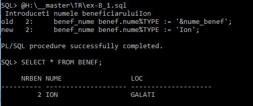

2. Confirmati actualizarile.
3. Adaugati o noua comanda care apartine acestui beneficiar. Codul comenzii este generat prin secventa Scom. In caz de incident la adaugarea comenzii, anulati-o.

```sql 
CREATE OR REPLACE PROCEDURE comanda_proc( cod_benef IN comanda.nrben%TYPE) IS
BEGIN
    INSERT INTO comanda
        VALUES (SCOM.NEXTVAL, cod_benef, SYSDATE);
    COMMIT;
EXCEPTION
    WHEN OTHERS THEN
        ROLLBACK;
END;
/
```

```sql 
ACCEPT nume_benef PROMPT ' Introduceti numele beneficiarului ';
DECLARE
    benef_nume benef.nume%TYPE := '&nume_benef';
    rezultat benef%ROWTYPE;
    cod NUMBER;
BEGIN
    SELECT * INTO rezultat
    FROM benef
    WHERE nume = upper(benef_nume);
    dbms_output.put_line('Beneficiarul ' || upper(rezultat.nume) || ' din ' || rezultat.loc || ' se afla in baza de date.');
    comanda_proc(rezultat.nrben);
EXCEPTION
    WHEN NO_DATA_FOUND THEN
            cod := SBEN.NEXTVAL;
            INSERT INTO benef
                VALUES (cod, upper(benef_nume), 'GALATI');
            comanda_proc(cod);
            COMMIT;
            
END;
/
```

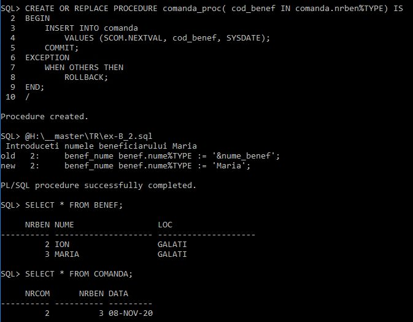

4. Inregistrati in tabela Detaliu, serviciile cerute prin comnanda. In caz de incident in acest timp, anulati continutul comenzii (serviciile comandate si comanda insasi)

```sql 
CREATE OR REPLACE PROCEDURE comanda_proc( cod_benef IN comanda.nrben%TYPE, nume_serv IN serviciu.den%TYPE) IS
cod_comanda comanda.nrcom%TYPE;
cod_serviciu serviciu.nrser%TYPE;
BEGIN
    cod_comanda := SCOM.NEXTVAL;
    INSERT INTO comanda
        VALUES (cod_comanda, cod_benef, SYSDATE);
    SELECT nrser INTO cod_serviciu
    FROM serviciu
    WHERE den LIKE nume_serv;
    INSERT INTO detaliu
        VALUES(cod_comanda, cod_serviciu, ADD_MONTHS(SYSDATE, 1));
    COMMIT;
EXCEPTION
    WHEN OTHERS THEN
        dbms_output.put_line('Eroare');
        ROLLBACK;
END;
/
```

```sql 
ACCEPT nume_benef PROMPT 'Introduceti numele beneficiarului ';
ACCEPT nume_serviciu PROMPT 'Introduceti numele serviciului ';
DECLARE
    benef_nume benef.nume%TYPE := '&nume_benef';
    serv_nume serviciu.den%TYPE := '&nume_serviciu';
    rezultat benef%ROWTYPE;
    cod NUMBER;
BEGIN
    SELECT * INTO rezultat
    FROM benef
    WHERE nume = upper(benef_nume);
    dbms_output.put_line('Beneficiarul ' || upper(rezultat.nume) || ' din ' || rezultat.loc || ' se afla in baza de date.');
    comanda_proc(rezultat.nrben, serv_nume);
EXCEPTION
    WHEN NO_DATA_FOUND THEN
            cod := SBEN.NEXTVAL;
            INSERT INTO benef
                VALUES (cod, upper(benef_nume), 'GALATI');
            COMMIT;
            comanda_proc(cod, serv_nume);            
END;
/
```

Simulati o tranzactie reala, provocand incidentele: de exemplu, anumite texte (de exemplu, 'HHH') introduse ca raspuns de la tastatura, pot fi luate drept incident. 

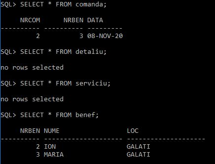

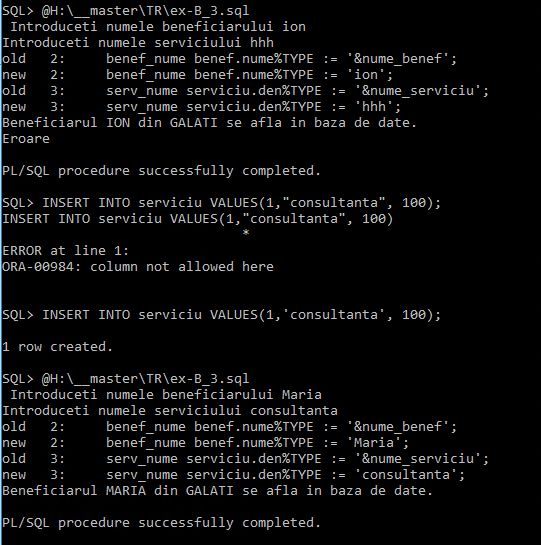

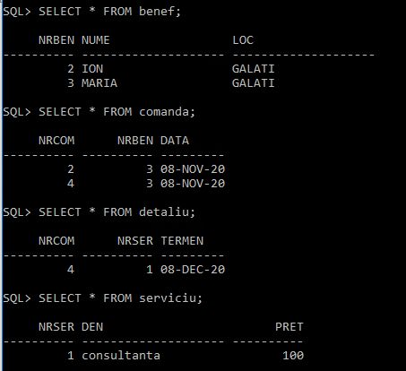
