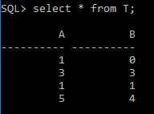
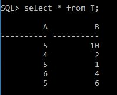

# Laborator PL/SQL - Tranzacții 2

## Conectare

**Mod de lucru:** serverul de la facultate


## Setări inițiale

```sql
SQL> set serveroutput on
SQL> set line 200
```

## Exercitii

Intocmiţi un referat de laborator unde notaţi rezultatele problemelor propuse mai jos, precum şi observaţiile si concluziile personale, ale dumneavoastră, la fiecare subiect.

Creaţi o tabelă T, cu două coloane numerice, A şi B.

Inseraţi trei rânduri, cu valorile (0,0), (2,3) et (0,1) şi confirmaţi tranzacţia. Deschideţi două sesiuni ale aceluiaşi utilizator, care derulează fiecare câte o tranzacţie, T1 şi T2.

Urmăriţi derularea tranzacţiilor în situaţiile următoare (momentele de timp sunt dispuse cronologic pe verticală, în jos); faceţi observaţii si trageţi concluzii


---

1


- Insert-ul din prima sesiune nu este vizibil in a doua pana la executia COMMIT
- Insert-ul din a doua sesiune este anulat de comanda ROLLBACK
- In final, doar insertul din prima sesiune este vizibil pentru toti  


---

2


- UPDATE-ul din sesiunea 2 este vizibil in sesiunea 1 dupa executarea comenzii COMMIT in sesiunea 2



---

3


- in sesiunea 1 se executa un UPDATE care marcheaza/blocheaza randurile ca fiind modificate
- in sesiunea 2 se INSERT-ul si primul DELETE functioneaza fara probleme, deoarece primul UPDATE vede datele de initiale (nu pe cele modificte de sesiunea 1) si conditia `A=2` nu este indeplinita
- la al doilea UPDATE, in datele initiale sunt randuri care satisfac conditia `A=1`, dar acestea sunt blocate de prima tranzactie
- dupa executarea comenzii COMMIT in prima sesiune, randurile sunt eliberate, dar conditia de la UPDATE (`A=1`) nu mai este indeplinita (nu mai sunt randuri cu acea valoare)


---

4


- primul UPDATE din sesiunea 1 si primul UPDATE din sesiunea 2 se desfasoara fara probleme
- in sesiunea 2 se insearca un UPDATE pe randurile modificate deja in sesiunea 1 (`A=3`), asadar sesiunea se blocheaza si asteapta
- in sesiunea 1 se incearca un UPDATE pe randurile modificate deja in sesiunea 2 (`B=2`), asadar sesiunea se blocheaza si asteapta
- in situatiile in care 2 sesiuni se asteapta una pe alta pentru eliberarea resurselor, SGBD-ul alege una dintre sesiuni si da mesaj de eroare (`ORA-00060: deadlock detected while waiting for resource`)


---

5


- desi comanda SELECT nu face parte din categoria LMD (limbaj de manipulare al datelor), `for UPDATE` indica SGBD-ului ca se doreste modificarea acelor randuri; in consecinta aceste randuri sunt blocate pana la comanda COMMIT


---

6


- `set transaction read only` blocheaza vizualizarea datelor la versiunea de dinainte de executia acestei comenzi
- daca in alta sesiune se executa COMMIT, modificarile nu sunt vizibile in sesiunea curenta pana la executia COMMIT-ului in sesiunea curenta.



---

7


- comanda CREATE face parte din categoria LDD (limbaj de definire a datelor) care inainte de executia lor, SGBD-ul face implicit COMMIT la modificarile efectuate anterior comenzii, iar dupa crearea tabelei se efectueaza iar COMMIT
- domanda DROP face parte din categoria LDD, asadar se efectueaza comit implicit
- comanda ROLLBACK nu are nici un efect (deoarece intre DROP si ROLLBACK nu exista nici o comanda LMD)


---

8

Goliti tabela T.

Definiti o cheie primara
```sql
alter table T add constraint T_Pkey primary key(A);
```
Executati urmatoarele programe PL/SQL; consultati tabela T dupa fiecare exercitiu si trageti concluzii. 

```sql
SQL> TRUNCATE TABLE t;

Table truncated.

SQL> alter table T add constraint T_Pkey primary key(a);

Table altered.

SQL> describe T;
 Name                      Null?    Type
 ----------------------- -------- -------
 A                        NOT NULL NUMBER
 B                        NOT NULL NUMBER

SQL> select * from T;

no rows selected
```

---

a)

```sql
begin
    insert into T values (-1,-1) ;
    savepoint p1 ;
    insert into T values (-2,-2) ;
    rollback to p1 ;
    commit ;
end;
/
```

- comanda `savepoint p1;` defineste un punct intermediar de salvare
- comanda ROLLBACK anuleaza toate modificariel efectuate **dupa** punctul p1 (deoarece are specificat `to p1`)
- COMMIT nu are specificat nici un parametru, asa ca salveaza toata sesiunea 


---

b)

```sql 
create or replace procedure p(i1 NUMBER, i2 NUMBER) is
begin
    insert into T values (i1,i2);
    insert into T values (i1,i2+1);
    insert into T values (i1+1,i2+1);
    commit;
end;
/
execute p(50,50);
```

- primul si al doilea INSERT incearca sa insereze un rand cu acelasi ID; din cauza constrangerii (chei primare unice) cel de-al doilea insert arunca o exceptie
- in final tranzactia este anulata si nu apare nici un insert in tabela


---

c)

```sql
create or replace procedure p(i1 NUMBER, i2 NUMBER) is
begin
    insert into T values (i1,i2);
    insert into T values (i1,i2+1);
    insert into T values (i1+1,i2+1);
    commit;
exception
    when others then dbms_output.put_line('pb insertion');
    commit;
end;
/
execute p(50,50);
```

- la fel ca in exercitiul precedent (pct. b) procedura arunca o exceptie
- blocul de tratare al exceptiilor o capteaza, afiseaza un mesaj si valideaza primul insert.
- in final, tabela va contine doar primul insert


---

d)

```sql 
create or replace procedure pp(i1 NUMBER, i2 NUMBER) is
begin
    insert into T values (i1,i2);
exception
    when others then dbms_output.put_line('pb insertion');
    commit;
end;
/
create or replace procedure p(i1 NUMBER, i2 NUMBER) is
begin
    insert into T values (i1,i2);
    pp(i1,i2); 
    insert into T values (i1+1,i2+2);
    commit;
exception
    when others then dbms_output.put_line('pb insertion');
    commit;
end;
/
execute p(60,60); 
```

- procedura pp incearca sa insereaze aceleasi valori ca linia aflata inaintea apelului
- procedura pp arunca eroare, dar este tratata printr-un mesaj si COMMIT
- executia procedurii p este continuat deoarece procedura pp a tratat exceptia


---

e)

```sql 
create or replace procedure pp(i1 NUMBER, i2 NUMBER) is
begin
    insert into T values (i1,i2);
    insert into T values (i1+1,i2+1);
exception
    when others then dbms_output.put_line('pb insertion pp');
end;
/
create or replace procedure p(i1 NUMBER, i2 NUMBER) is
begin
    insert into T values (i1,i2);
    pp(i1+1,i2);
    insert into T values (i1+1,i2+2);
    commit;
exception
    when others then dbms_output.put_line('pb insertion p');
    rollback;
end;
/
execute p(70,70); 
```

- NO COMMENT


---

f)

```sql 
create or replace procedure pp(i1 NUMBER, i2 NUMBER) is
begin
    insert into T values (i1,i2);
    insert into T values (i1+1,i2+1);
    commit;
exception
    when others then dbms_output.put_line('pb insertion pp');
end;
/
execute p(80,80); 
```

- in procedura p, al doilea INSERT arunca o exceptie deoarece procedura pp a inserat deja un rand cu ID-ul/cheia primara 81
- comanda COMMIT din procedura pp valideaza insert-urile din procedura pp si primul INSERT din procedura p


---

g)

```sql 
create or replace procedure pp(i1 NUMBER, i2 NUMBER) is
    pragma autonomous_transaction ;
begin
    insert into T values (i1,i2);
    insert into T values (i1+1,i2+1);
    commit;
exception
    when others then dbms_output.put_line('pb insertion pp');
end;
/
execute p(90,90); 
```

- la fel ca in cazul anterior, al doilea INSERT arunca o exceptie
- in cazul curent, procedura pp este definita ca fiind `pragma autonomous_transaction` ceea ce inseamna ca se executa intr-o tranzactie separata
- din acest motiv, primul INSERT din procedura p nu apare in rezultatul final (fiind anulat de comanda ROLLBACK din tratarea exceptiei) 

